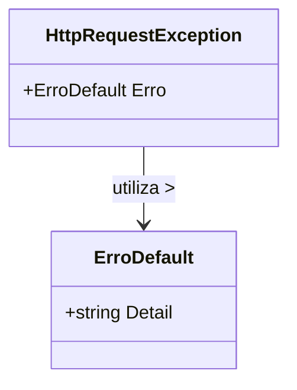

# HttpRequestException

**Namespace**: IsthmusWinthor.Dominio.Exceptions  
**Nome do Arquivo**: HttpRequestException.cs

A classe `HttpRequestException` é um modelo de exceção especializado que encapsula informações sobre um erro ocorrido durante uma solicitação HTTP, promovendo uma forma estruturada de reportar problemas de forma que possam ser facilmente consumidos pelas camadas superiores da aplicação.

## Métodos de Negócio

### HttpRequestException(ErroDefault erro) - Visibilidade: Pública
- **Objetivo**: Garante que a classe armazene um erro detalhado proveniente de uma solicitação HTTP, encapsulando o detalhe da falha no objeto de exceção.
- **Comportamento**:
  1. Recebe um objeto `ErroDefault` como parâmetro.
  2. Chama o construtor da classe base `Exception`, passando a descrição do erro (`Detail`) para garantir que as informações da exceção sejam preservadas.
  3. Atribui o erro recebido à propriedade `Erro` da classe.
- **Retorno**: Não há valor retornado; no entanto, a instância gerada pode ser lançada ou manipulada para tratamento de erros na aplicação.

### HttpRequestException() - Visibilidade: Pública
- **Objetivo**: Cria uma instância da exceção sem detalhes de erro, permitindo tratamento genérico de erro.
- **Comportamento**: Este construtor simplesmente chama o construtor padrão da classe base `Exception`, resultando em uma exceção mais genérica.
- **Retorno**: Não há valor retornado.

## Propriedades Calculadas e de Validação
- `Erro`: Propriedade que guarda um objeto do tipo `ErroDefault`, permitindo acesso às informações detalhadas do erro da solicitação HTTP.

## Navigations Property
Não há propriedades de navegação complexas nesta classe, uma vez que `HttpRequestException` é focada na manipulação de exceções e não contém ligações a outras entidades do domínio.

## Tipos Auxiliares e Dependências
- `ErroDefault`: Esta classe é utilizada como um tipo auxiliar para fornecer detalhes sobre o erro ocorrendo durante a solicitação HTTP.

## Diagrama de Relacionamentos

Esta documentação apresenta um resumo conciso das responsabilidades e comportamentos da classe `HttpRequestException`, organizando as informações de forma a facilitar a compreensão da lógica de erros que ela implementa.
---
Gerada em 29/12/2025 21:10:28
