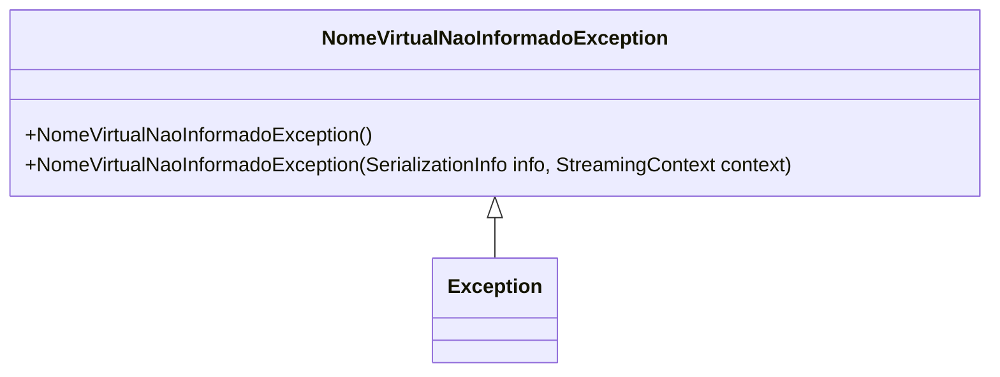

# NomeVirtualNaoInformadoException
**Namespace**: IsthmusWinthor.Dominio.Exceptions  
**Nome do Arquivo**: NomeVirtualNaoInformadoException.cs

A classe `NomeVirtualNaoInformadoException` é uma exceção personalizada que serve para indicar a ausência do nome virtual em contextos de domínio dentro do sistema. Ela é utilizada como parte das regras de validação para garantir que um nome virtual sempre seja fornecido quando necessário, ajudando a manter a integridade dos dados.

## Métodos de Negócio

### Título: NomeVirtualNaoInformadoException() - Visibilidade: Public
- **Objetivo**: Garante que uma exceção específica seja lançada quando o nome virtual não é fornecido.
- **Comportamento**: 
  1. Um novo objeto `NomeVirtualNaoInformadoException` é criado.
  2. A mensagem padrão "NomeVirtual não informado!" é passada como argumento para o construtor da classe base `Exception`.
- **Retorno**: Não aplica, pois é um construtor.

### Título: NomeVirtualNaoInformadoException(SerializationInfo, StreamingContext) - Visibilidade: Protected
- **Objetivo**: Fornece suporte à serialização da exceção personalizada.
- **Comportamento**:
  1. O construtor recebe informações de serialização e contexto.
  2. A classe base `Exception` é inicializada com essas informações, permitindo recuperar a exceção estudada em diferentes contextos de execução (como em remotos).
- **Retorno**: Não aplica, pois é um construtor.

## Diagrama de Relacionamentos

Neste diagrama, a classe `NomeVirtualNaoInformadoException` é uma extensão da classe `Exception`, representando sua relação de herança. Essa estrutura permite que a exceção personalizada se beneficie de todas as funcionalidades da classe de exceção base.
---
Gerada em 29/12/2025 21:10:39
