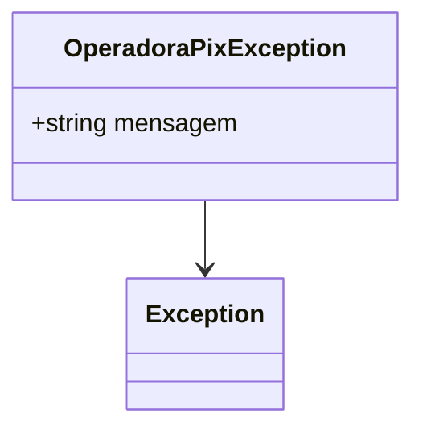

# OperadoraPixException
**Namespace**: IsthmusWinthor.Dominio.Exceptions  
**Nome do Arquivo**: OperadoraPixException.cs  

A classe `OperadoraPixException` é uma exceção personalizada destinada a lidar com erros relacionados a operadoras de pagamento do tipo PIX no sistema. Ela possibilita que o sistema capture defeitos específicos ligados à validade e à integridade das operadoras PIX, permitindo um tratamento adequado de tais condições no fluxo da aplicação. 

## Métodos de Negócio

### 1. OperadoraPixException(string mensagem) - Visibilidade: público
- **Objetivo**: Garante que uma mensagem de erro específica seja fornecida ao lançar uma exceção, permitindo diferenciá-la de outras exceções.
- **Comportamento**: 
  1. O construtor da classe é chamado com uma mensagem opcional. Se nenhuma mensagem for fornecida, a mensagem padrão "Operadora PIX inválida!" é utilizada.
  2. O construtor da classe base `Exception` é invocado, passando a mensagem apropriada.
- **Retorno**: Não aplica, já que este é um construtor. A exceção instanciada pode ser usada para sinalizar erros em outras partes do código.

## Diagrama de Relacionamentos

### Considerações Finais
A `OperadoraPixException` serve como um componente vital para assegurar a robustez do sistema em relação à lógica de negócios que envolve transações PIX, garantindo que exceções adequadas sejam lançadas e tratadas conforme as regras de negócio.
