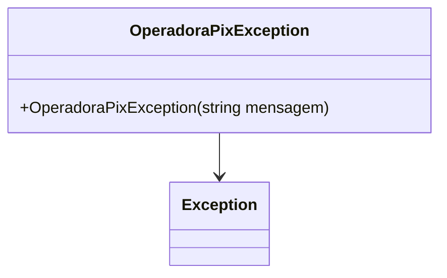

# OperadoraPixException
**Namespace**: IsthmusWinthor.Dominio.Exceptions  
**Nome do Arquivo**: OperadoraPixException.cs  

### Visão Geral e Responsabilidade
A classe `OperadoraPixException` é uma implementação da exceção customizada em C#, essencial para lidar com erros relacionados a operadoras de pagamento via Pix. Seu papel no sistema é proporcionar um controle de fluxo adequado em situações onde a operadora Pix não é válida, garantindo que o sistema responda de forma adequada a falhas de validação.

### Métodos de Negócio
#### Título: Construtor público
- **Objetivo**: Garante que uma mensagem de erro específica seja gerada quando uma operadora Pix inválida é encontrada.
- **Comportamento**: 
  1. Recebe uma mensagem como parâmetro. Se não houver mensagem fornecida, um valor padrão ("Operadora PIX inválida!") é utilizado.
  2. Chama o construtor da classe base `Exception` com a mensagem fornecida.
- **Retorno**: Esta exceção não retorna valores, mas serve para interromper o fluxo normal do programa e sinalizar um erro de validação.

### Propriedades Calculadas e de Validação
Não há propriedades calculadas ou de validação nesta classe, uma vez que sua implementação se restringe ao manejo de erros com o uso de mensagens.

### Navigation Property
Não há propriedades de navegação dentro desta classe, pois ela é uma exceção que não contém referências a outras classes de domínio.

### Tipos Auxiliares e Dependências
- Não há tipos auxiliares, enums ou classes estáticas que são utilizados por esta classe.

### Diagrama de Relacionamentos

---
Gerada em 29/12/2025 21:10:47
