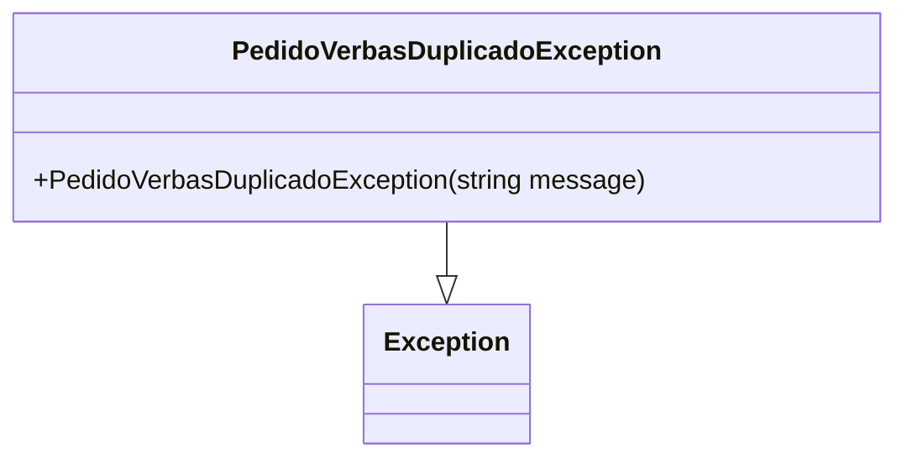

# PedidoVerbasDuplicadoException
**Namespace**: IsthmusWinthor.Dominio.Exceptions  
**Nome do Arquivo**: PedidoVerbasDuplicadoException.cs  

### Visão Geral e Responsabilidade
A classe `PedidoVerbasDuplicadoException` é uma exceção customizada que indica a ocorrência de tentando registrar um pedido de verbas que já foi gerado anteriormente. Esta classe é crucial para tratar cenários em que a lógica do negócio não admite a duplicidade de pedidos, assegurando a integridade dos dados e evitando inconsistências na negociação de verbas.

### Métodos de Negócio
- **Título**: PedidoVerbasDuplicadoException(string message) - Visibilidade: Público
  - **Objetivo**: Garante que uma exceção seja lançada quando um pedido de verbas é duplicado, evitando que o sistema permita essa situação.
  - **Comportamento**: 
    1. O construtor da classe é chamado e aceita uma mensagem opcional.
    2. Chama o construtor base da classe `Exception`, passando a mensagem para descrever o erro.
  - **Retorno**: Não possui um retorno, pois é uma exceção e sua função é interromper o fluxo normal da aplicação em caso de erro.

### Propriedades Calculadas e de Validação
Não há propriedades calculadas ou de validação, uma vez que a classe é uma exceção e não possui propriedades que requeiram de tal processamento.

### Navigations Property
Não há propriedades que representem classes complexas do domínio nesta classe.

### Tipos Auxiliares e Dependências
Não utiliza tipos auxiliares ou enums.

### Diagrama de Relacionamentos

