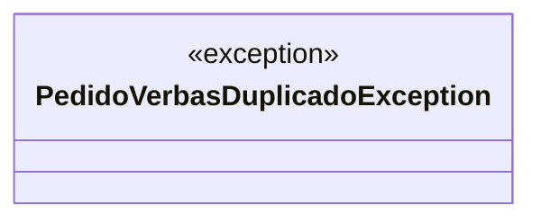

# PedidoVerbasDuplicadoException

**Namespace**: IsthmusWinthor.Dominio.Exceptions  
**Nome do Arquivo**: PedidoVerbasDuplicadoException.cs  

## Visão Geral e Responsabilidade
A classe `PedidoVerbasDuplicadoException` é um modelo de exceção que representa uma situação de erro específica no contexto de negócios onde uma negociação tentaria gerar pedidos duplicados. O propósito dela é garantir que a lógica de criação de pedidos não permita a duplicidade, fornecendo um mecanismo para sinalizar essa condição ao sistema, permitindo assim que o fluxo de execução seja controlado de maneira adequada.

## Métodos de Negócio
### Título: PedidoVerbasDuplicadoException (public)
- **Objetivo**: Este construtor de exceção indica que um pedido já foi gerado para uma negociação, o que é uma violação da regra de negócio que proíbe a duplicação de pedidos.
- **Comportamento**: O construtor chamará a classe base `Exception`, passando uma mensagem padrão que informa sobre a duplicação de pedidos.
- **Retorno**: Não aplica, pois é um construtor de exceção.

## Propriedades Calculadas e de Validação
Não existem propriedades calculadas ou de validação nesta classe, pois ela se concentra exclusivamente em representar uma exceção sem lógica adicional.

## Navigation Property
Não existem propriedades de navegação nesta classe, pois é uma exceção simples sem relacionamentos complexos com outros objetos do domínio.

## Tipos Auxiliares e Dependências
Não há enumeradores ou classes auxiliares específicas utilizadas nesta classe.

## Diagrama de Relacionamentos

A classe `PedidoVerbasDuplicadoException` não possui relações complexas ou dependências com outras classes dentro do domínio, servindo como um alerta isolado para erro de regras de negócio.
---
Gerada em 29/12/2025 21:10:54
