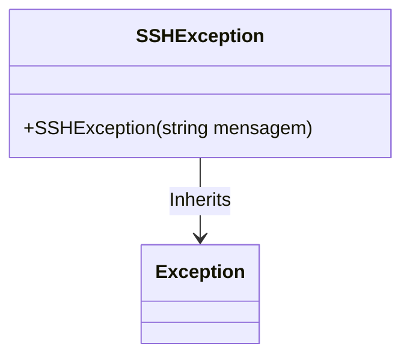

# SSHException
**Namespace**: IsthmusWinthor.Dominio.Exceptions  
**Nome do Arquivo**: SSHException.cs  

## Visão Geral e Responsabilidade
A classe `SSHException` é uma exceção personalizada que serve para encapsular erros que ocorrem especificamente durante tentativas de conexão via SSH. Ela garante que erros relacionados a esse protocolo sejam tratados de forma consistente e informativa no sistema, facilitando o diagnóstico de problemas de conectividade.

## Métodos de Negócio

### Título: `SSHException(string mensagem)` - Visibilidade: `public`
- **Objetivo**: Garante que uma mensagem padrão ou uma mensagem personalizada possa ser enviada ao criar uma nova instância da exceção, permitindo que o desenvolvedor compreenda rapidamente a natureza do erro.
- **Comportamento**: 
  1. O construtor é chamado com uma mensagem, que pode ser a mensagem padrão “Erro na conexão SSH” ou uma mensagem específica fornecida pelo desenvolvedor.
  2. A mensagem é passada para o construtor da classe base `Exception`, que trata adequadamente a inicialização da exceção.
- **Retorno**: Não retorna um valor, mas inicializa uma nova instância de `SSHException`.

## Propriedades Calculadas e de Validação
Não há propriedades com lógica de validação ou cálculo nesta classe, pois ela se concentra em fornecer uma exceção.

## Navigation Property
Não há propriedades de navegação associadas a esta classe.

## Tipos Auxiliares e Dependências
Não há enumeradores ou classes auxiliares utilizadas diretamente na classe `SSHException`.

## Diagrama de Relacionamentos

