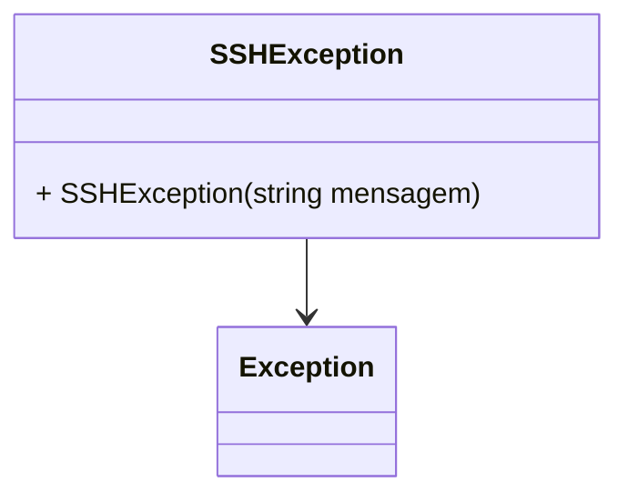

# SSHException

**Namespace**: IsthmusWinthor.Dominio.Exceptions  
**Nome do Arquivo**: SSHException.cs

Esta classe representa uma exceção customizada que é levantada em casos de erro durante a conexão SSH. Ela é utilizada no contexto de manuseio de erros em operações relacionadas a comunicação segura via SSH, o que é fundamental para assegurar a integridade e a securidade nas transferências de dados.

## Métodos de Negócio

### SSHException(string mensagem) - Construtor
- **Objetivo**: Este método garante que uma mensagem apropriada é passada quando a exceção é levantada, permitindo que o desenvolvedor entenda o contexto do erro SSH.
- **Comportamento**: O construtor recebe uma string como parâmetro que fornece uma descrição do erro. Se nenhuma mensagem específica for fornecida, a mensagem padrão "Erro na conexão SSH" é usada. Esta mensagem é então passada para a classe base `Exception` para garantir que a exceção se comporte como uma exceção comum do .NET, carregando informações sobre seu estado.
- **Retorno**: Não há retorno, mas a instância de `SSHException` criada contém a mensagem de erro.

## Propriedades Calculadas e de Validação
Não há propriedades calculadas ou de validação nesta classe, uma vez que se trata de uma exceção que não possui estado mutável além do transmitido pela mensagem da exceção.

## Navigations Property
Não há propriedades de navegação nesta classe, pois ela não possui referências a outras classes do domínio.

## Tipos Auxiliares e Dependências
- Nenhum tipo auxiliar ou dependência é utilizado por esta classe.

## Diagrama de Relacionamentos

---
Gerada em 29/12/2025 21:11:03
