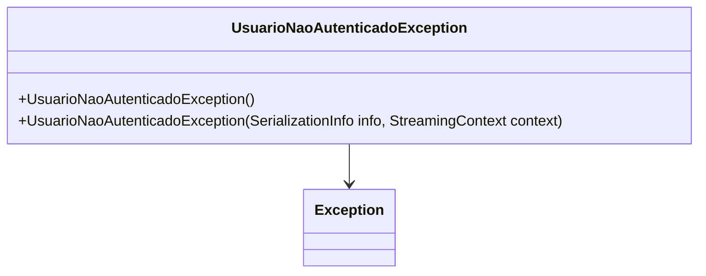

# UsuarioNaoAutenticadoException
- **Namespace**: IsthmusWinthor.Dominio.Exceptions
- **Nome do Arquivo**: UsuarioNaoAutenticadoException.cs

Esta classe representa uma exceção lançada quando um usuário não está autenticado.

## Visão Geral e Responsabilidade
A classe `UsuarioNaoAutenticadoException` é uma implementação específica de exceção que indica que uma operação que requer um usuário autenticado foi tentada sem que um usuário estivesse autenticado. Essa exceção ajuda a garantir a integridade dos fluxos de autenticação e autorização no sistema, permitindo que o desenvolvedor gerencie cenários em que a autenticação é necessária.

## Métodos de Negócio
### Construtor: `UsuarioNaoAutenticadoException()`
- **Objetivo**: Garante que uma mensagem padrão seja fornecida quando a exceção é lançada.
- **Comportamento**: 
  1. Chama o construtor da classe base `Exception`, passando uma mensagem que indica que nenhum usuário está autenticado.
- **Retorno**: N/A (construtor não retorna valor).

### Construtor Personalizado: `UsuarioNaoAutenticadoException(SerializationInfo info, StreamingContext context)`
- **Objetivo**: Permite a serialização da exceção personalizada.
- **Comportamento**: 
  1. Chama o construtor da classe base `Exception` para garantir que os dados de serialização sejam corretamente tratados.
- **Retorno**: N/A (construtor não retorna valor).

## Propriedades Calculadas e de Validação
A classe não possui propriedades calculadas ou de validação, já que sua única funcionalidade é o gerenciamento de exceções.

## Navigations Property
Não há propriedades que sejam classes complexas do domínio.

## Tipos Auxiliares e Dependências
- Nenhum enumerador ou classe estática/helper é utilizado por esta classe.

## Diagrama de Relacionamentos

