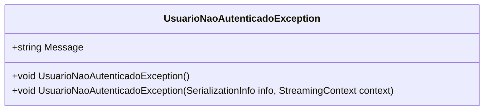

# UsuarioNaoAutenticadoException
**Namespace**: IsthmusWinthor.Dominio.Exceptions  
**Nome do Arquivo**: UsuarioNaoAutenticadoException.cs  

A classe `UsuarioNaoAutenticadoException` representa uma exceção específica que é lançada quando não há um usuário autenticado no sistema. Seu propósito é garantir a integridade da lógica de negócios ao sinalizar uma condição de erro durante a execução de operações que requerem um usuário autenticado.

## Métodos de Negócio

### Título: Construtor Público
** Objetivo:** Garante que a exceção é lançada com uma mensagem clara referente à falta de autenticação do usuário.  
** Comportamento:** Quando instanciada, a classe chama o construtor da classe base `Exception`, passando uma mensagem fixa: "Nenhum usuário autenticado!". Essa mensagem é utilizada para informar ao desenvolvedor ou usuário do sistema que uma operação dependente de autenticação falhou devido à ausência de um token ou sessão de usuário válida.  
** Retorno:** Nenhum valor retornado, a ação é a criação da exceção.

### Título: Construtor de Serialização (protegido)
** Objetivo:** Permite a serialização da exceção, garantindo que o estado da exceção possa ser mantido durante o processo de serialização e desserialização.  
** Comportamento:** Este construtor é utilizado quando a exceção precisa ser serializada, recebendo um objeto `SerializationInfo` e um contexto de streaming. A lógica aqui simplesmente chama o construtor da classe base `Exception` com os mesmos parâmetros transmitidos, mantendo a mensagem de erro.  
** Retorno:** Nenhum valor retornado, utilizado para processos de serialização.

## Propriedades Calculadas e de Validação
Não há propriedades calculadas ou de validação na classe, pois é uma exceção simples e não possui estados ou dados adicionais a serem validados.

## Navigation Property
Não há propriedades de navegação nesta classe, já que ela é uma exceção e não contém qualquer outra entidade complexa.

## Tipos Auxiliares e Dependências
Não há enumeradores ou classes estáticas/helpers que a classe utilize.

## Diagrama de Relacionamentos

---
Gerada em 29/12/2025 21:11:15
