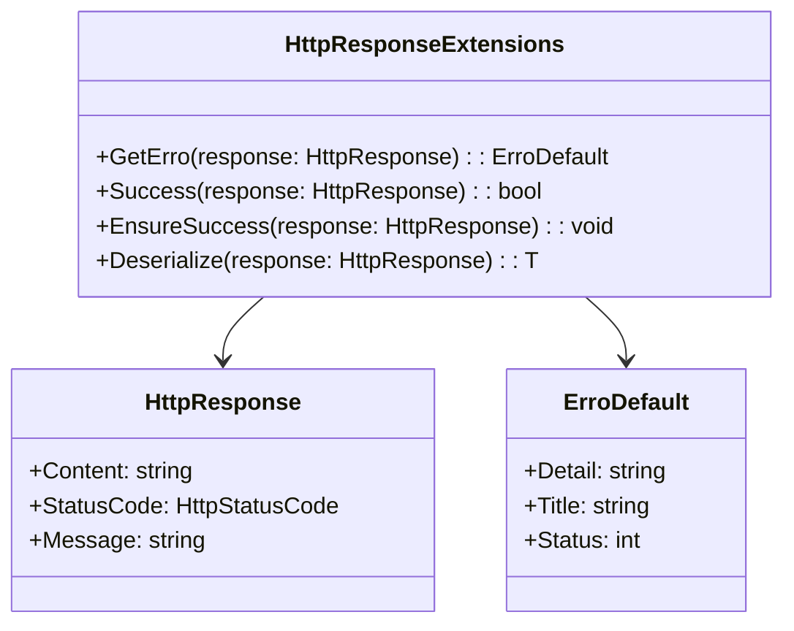

# HttpResponseExtensions

- **Namespace**: IsthmusWinthor.Dominio.Extensions
- **Nome do Arquivo**: HttpResponseExtensions.cs

## Visão Geral e Responsabilidade
A classe `HttpResponseExtensions` fornece métodos de extensão que facilitam o tratamento de respostas de HTTP, encapsulando a lógica necessária para verificar a integridade do response e extrair informações de erro. Ela atua como uma camada de abstração para melhorar a robustez e a legibilidade do código em relação ao gerenciamento de respostas HTTP, garantindo que erros sejam tratados de forma consistente e que os desenvolvedores possam interagir facilmente com o conteúdo da resposta.

## Métodos de Negócio

### Método: `GetErro`
- **Visibilidade**: `public static`
- **Objetivo**: Extrair um objeto de erro a partir da resposta HTTP, assegurando que qualquer falha na desserialização resulte em um objeto de erro padrão com detalhes informativos.
- **Comportamento**:
  1. Tenta desserializar o corpo da resposta HTTP em um objeto `ErroDefault`.
  2. Se a desserialização falhar (exceções), cria um novo objeto `ErroDefault` com detalhes padrão, como o status e uma mensagem de erro informativa.
- **Retorno**: Retorna um objeto `ErroDefault` que contém a mensagem de erro e status relacionados à resposta.

### Método: `Success`
- **Visibilidade**: `public static`
- **Objetivo**: Verificar se a resposta HTTP foi bem-sucedida de acordo com os códigos de status comuns.
- **Comportamento**:
  1. Avalia se o status da resposta é um dos seguintes: OK (200), Created (201), Accepted (202), ou NoContent (204).
- **Retorno**: Retorna um valor booleano indicando se a resposta foi bem-sucedida.

### Método: `EnsureSuccess`
- **Visibilidade**: `public static`
- **Objetivo**: Garantir que a resposta HTTP seja bem-sucedida; caso contrário, lança uma exceção com detalhes da falha.
- **Comportamento**:
  1. Verifica a resposta chamando o método `Success()`.
  2. Se a resposta não for bem-sucedida, utiliza o método `GetErro()` para obter informações sobre o erro e lança uma `HttpRequestException`.
  
### Método: `Deserialize<T>`
- **Visibilidade**: `public static`
- **Objetivo**: Desserializar o conteúdo da resposta HTTP em um objeto do tipo especificado.
- **Comportamento**:
  1. Verifica se o conteúdo da resposta é nulo ou vazio.
  2. Se não for, desserializa e retorna o conteúdo como um objeto do tipo T.
- **Retorno**: Retorna um objeto do tipo T, ou o valor padrão se o conteúdo estiver vazio.

## Propriedades Calculadas e de Validação
Não existem propriedades com lógica de validação ou cálculo nesta classe.

## Navigations Property
Não há propriedades que representem classes complexas do domínio.

## Tipos Auxiliares e Dependências
- **Classes**:
  - `ErroDefault` - [ErroDefault](ErroDefault.md)
  
- **Enums**:
  - `HttpStatusCode` - [HttpStatusCode](HttpStatusCode.md)

## Diagrama de Relacionamentos

Esta documentação técnica segue as diretrizes estabelecidas, fornecendo uma visão clara das responsabilidades, regras e do funcionamento interno da classe `HttpResponseExtensions`.
---
Gerada em 29/12/2025 21:11:55
