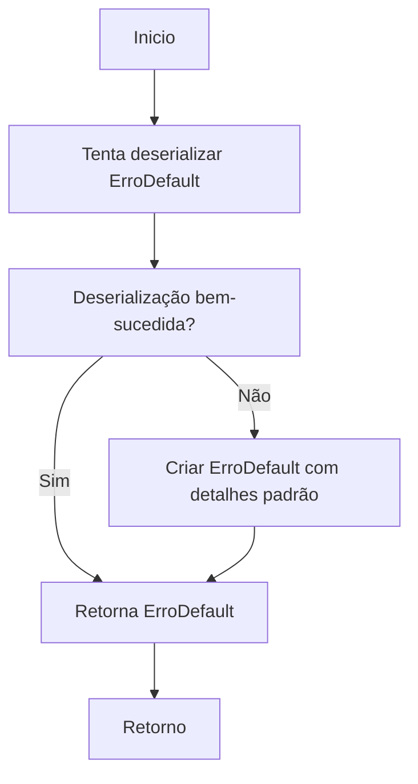
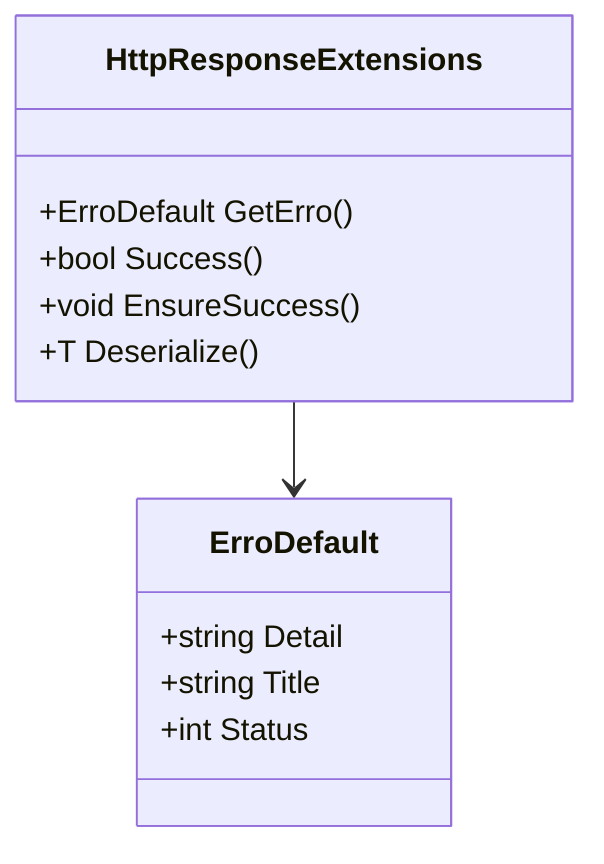

# HttpResponseExtensions

**Namespace**: IsthmusWinthor.Dominio.Extensions  
**Nome do Arquivo**: HttpResponseExtensions.cs  

## Visão Geral e Responsabilidade
A classe `HttpResponseExtensions` contém métodos de extensão que facilitam a manipulação e avaliação de objetos do tipo `HttpResponse`. Esses métodos são essenciais para garantir que as respostas de serviços web sejam tratadas corretamente, promovendo uma lógica consistente de tratamento de erros e validação do sucesso da operação. A classe aborda a necessidade de deserializar conteúdos de resposta e verificar o estado da resposta, permitindo que o sistema reaja adequadamente a diferentes cenários de resposta.

## Métodos de Negócio

### Título: GetErro (Protegido)
- **Objetivo**: Este método busca garantir que o sistema possa extrair e fornecer informações de erro de forma correta a partir de uma resposta HTTP em caso de falha.
- **Comportamento**:
  1. Tenta deserializar o conteúdo da resposta JSON em uma instância da classe `ErroDefault`.
  2. Caso a deserialização falhe, uma nova instância de `ErroDefault` é criada, preenchendo detalhes com informações disponíveis na resposta (ou mensagens padrão em caso de ausência).
- **Retorno**: Retorna um objeto `ErroDefault` que contém detalhes sobre o erro ocorrido, permitindo que as partes posteriores do sistema visualizem e tratem o erro adequadamente.

### Título: Success (Protegido)
- **Objetivo**: Verificar se a resposta HTTP indica sucesso (status OK, Created, Accepted ou NoContent).
- **Comportamento**:
  1. Avalia o código de status da resposta.
  2. Retorna `true` se o código de status corresponder a um dos padrões de sucesso.
- **Retorno**: Retorna um valor booleano que indica se a operação foi bem-sucedida.

### Título: EnsureSuccess (Protegido)
- **Objetivo**: Garantir que a resposta HTTP seja bem-sucedida, lançando uma exceção se não for.
- **Comportamento**:
  1. Chama o método `Success()` para verificar o estado da resposta.
  2. Se a resposta não for bem-sucedida, lança uma exceção `HttpRequestException`, associando-a com o erro obtido por `GetErro()`.
- **Retorno**: Não possui retorno, mas lança uma exceção se a pré-condição de sucesso não for atendida.

### Título: Deserialize<T> (Protegido)
- **Objetivo**: Deserializar o conteúdo da resposta HTTP em um objeto do tipo especificado.
- **Comportamento**:
  1. Verifica se o conteúdo da resposta está em branco ou é nulo.
  2. Realiza a deserialização do conteúdo JSON em um objeto do tipo `T`.
- **Retorno**: Retorna um objeto do tipo `T`, ou o valor padrão se o conteúdo estiver vazio.

## Propriedades Calculadas e de Validação
- Não foram identificadas propriedades calculadas ou validações na classe.

## Navigations Property
- Não foram identificadas propriedades de navegação complexas na classe.

## Tipos Auxiliares e Dependências
- Classe de Erro: `[ErroDefault](ErroDefault.md)`
- Dependência de JSON: `Newtonsoft.Json`

## Diagrama de Relacionamentos

Essa documentação técnica respeita as regras de negócio e a integridade dos dados, fornecendo uma visão clara e concisa dos métodos e suas finalidades no contexto da manipulação de respostas HTTP.
