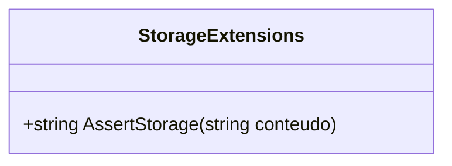

# StorageExtensions

**Namespace**: IsthmusWinthor.Dominio.Extensions  
**Nome do Arquivo**: StorageExtensions.cs

## Visão Geral e Responsabilidade
A classe `StorageExtensions` tem como principal responsabilidade o fornecimento de métodos de extensão para manipulação de URLs de armazenamento. Ela resolve o problema de garantir que qualquer URL de domínio antigo presente em um conteúdo seja substituído pelo domínio atual. Isso é essencial para a manutenção da integridade dos dados, evitando referências a domínios obsoletos e assegurando que o acesso aos recursos seja sempre feito através do domínio vigente.

## Métodos de Negócio

### Título: AssertStorage (public)

#### Objetivo
Garante que um conteúdo que contém URLs de domínios antigos seja atualizado para o domínio atual.

#### Comportamento
1. A função verifica se o `conteudo` passado como parâmetro é nulo ou vazio. Se for, retornará imediatamente o `conteudo` sem alterações.
2. Se o `conteudo` tiver valor, a função itera sobre a lista de domínios antigos.
3. Para cada domínio antigo encontrado, o método substitui todas as ocorrências desse domínio na string `conteudo` pelo domínio atual (`_dominioAtual`).
4. Por fim, retorna o `conteudo` modificado.

#### Retorno
Retorna uma string que representa o `conteudo` atualizado, com todas as referências a domínios antigos substituídas pelo domínio atual.

## Propriedades Calculadas e de Validação
- A classe não possui propriedades com lógica no `get` ou validação no `set`, pois trata-se de uma classe estática com métodos de extensão.

## Navigations Property
- Não há propriedades de navegação, pois a classe contém apenas métodos e não referencia outras classes do domínio.

## Tipos Auxiliares e Dependências
- Não há enumeradores ou classes estáticas/helpers que a classe utiliza, uma vez que é uma classe de extensão simples.

## Diagrama de Relacionamentos

Essa documentação fornece uma visão clara sobre a funcionalidade e a responsabilidade da classe `StorageExtensions`, descrevendo sua lógica de negócio e assegurando a integridade dos dados durante a substituição de domínios antigos.
---
Gerada em 29/12/2025 21:12:04
