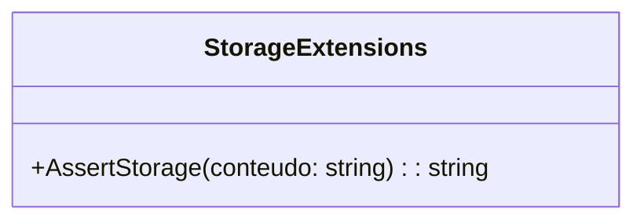

# StorageExtensions
**Namespace**: IsthmusWinthor.Dominio.Extensions  
**Nome do Arquivo**: StorageExtensions.cs  

## Visão Geral e Responsabilidade
A classe `StorageExtensions` fornece métodos de extensão para manipulação de URLs, permitindo a atualização de links de armazenamento em nuvem. O principal problema de negócio que essa classe resolve é garantir que todos os links utilizados nos dados do sistema sejam atualizados para um único domínio atual, evitando erros de referência a domínios obsoletos.

## Métodos de Negócio

### Título: AssertStorage (public)
- **Objetivo**: Garante que o conteúdo de texto fornecido contenha URLs corretas, substituindo domínios antigos pelo domínio atual.
- **Comportamento**:
  1. Verifica se o conteúdo é nulo ou vazio; se sim, retorna o conteúdo como está.
  2. Itera sobre a lista de domínios antigos.
  3. Para cada domínio antigo, substitui ocorrências desse domínio no `conteudo` pelo domínio atual, ignorando letras maiúsculas e minúsculas.
  4. Retorna o conteúdo atualizado.
- **Retorno**: O conteúdo de texto com todos os domínios antigos substituídos pelo domínio atual. Se não houver alterações, o conteúdo original é retornado.

## Propriedades Calculadas e de Validação
Nenhuma propriedade calculada ou de validação está presente nesta classe, uma vez que ela se restringe a métodos estáticos.

## Navigation Property
Nenhuma Navigation Property é definida nesta classe, pois todos os métodos pertencem à lógica de extensão e não interagem diretamente com outras classes do domínio.

## Tipos Auxiliares e Dependências
- Nenhum enumerador (enum) ou classe estática/helper é utilizado nesta classe, visto que ela não depende de outras entidades.

## Diagrama de Relacionamentos

