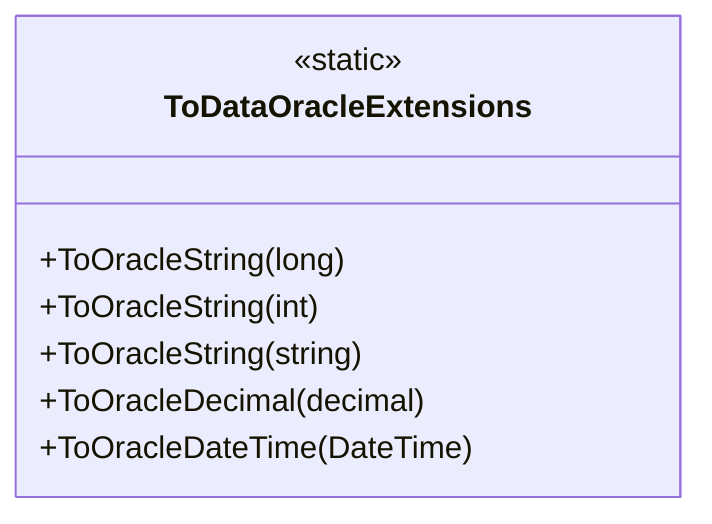

# ToDataOracleExtensions

**Namespace**: IsthmusWinthor.Dominio.Extensions  
**Nome do Arquivo**: ToDataOracleExtensions.cs  

## Visão Geral e Responsabilidade
A classe `ToDataOracleExtensions` é uma coleção de métodos de extensão desenvolvidos para facilitar a conversão de tipos de dados comuns (como `long`, `int`, `string`, `decimal`, `DateTime`, e `bool`) para formatos correspondentes utilizados em consultas Oracle. Esses métodos garantem que os valores sejam corretamente formatados e adequadamente representados em SQL, com opções para retornar `NULL` quando apropriado, garantindo a integridade dos dados durante a interação com o banco de dados.

## Métodos de Negócio

### Método: ToOracleString(long @this, bool nullIfZero)
- **Objetivo**: Este método converte um valor do tipo `long` em uma representação de string para SQL, podendo retornar `NULL` se o valor for zero quando a flag `nullIfZero` for verdadeira.
- **Comportamento**:
  1. Verifica se `nullIfZero` é verdadeiro e se o valor passado é zero.
  2. Se ambas as condições forem verdadeiras, retorna "NULL".
  3. Caso contrário, retorna o valor como uma string formatada.
- **Retorno**: Retorna uma string representando o valor ou "NULL".

```mermaid
flowchart TD
    A[Receber long @this] --> B{nullIfZero}
    B --|true| C{@this == 0}
    C --|true| D["NULL"]
    C --|false| E[Formatar string]
    B --|false| E
```

### Método: ToOracleString(int @this, bool nullIfZero)
- **Objetivo**: Este método realiza a conversão de um valor do tipo `int` em uma string para SQL, com a mesma lógica de `nullIfZero`.
- **Comportamento**:
  1. Verifica se `nullIfZero` é verdadeiro e o valor é zero.
  2. Retorna "NULL" se as condições forem verdadeiras, caso contrário, retorna o valor em formato de string.
- **Retorno**: Retorna uma string representando o valor ou "NULL".

```mermaid
flowchart TD
    A[Receber int @this] --> B{nullIfZero}
    B --|true| C{@this == 0}
    C --|true| D["NULL"]
    C --|false| E[Formatar string]
    B --|false| E
```

### Método: ToOracleString(string @this, bool nullIfNullOrEmpty)
- **Objetivo**: Converte uma string, retornando "NULL" se ela estiver vazia ou nula, conforme a configuração de `nullIfNullOrEmpty`.
- **Comportamento**:
  1. Checa se a string é nula ou vazia e se `nullIfNullOrEmpty` é verdadeiro.
  2. Se ambas as condições forem verdadeiras, retorna "NULL".
  3. Caso contrário, escapa apóstrofos e retorna a string formatada.
- **Retorno**: Retorna a string formatada ou "NULL".

```mermaid
flowchart TD
    A[Receber string @this] --> B{nullIfNullOrEmpty}
    B --|true| C{string.IsNullOrEmpty(@this)}
    C --|true| D["NULL"]
    C --|false| E[Escapar apóstrofos e retornar]
    B --|false| E
```

### Método: ToOracleDecimal(decimal @this, bool nullIfZero)
- **Objetivo**: Converte um valor decimal em string, retornando "NULL" se o valor for zero e `nullIfZero` for verdadeiro.
- **Comportamento**:
  1. Verifica se `nullIfZero` é verdadeiro e se o decimal é zero.
  2. Retorna "NULL", se verdadeiro; caso contrário, retorna o valor convertido para string, com a vírgula substituída por um ponto.
- **Retorno**: Retorna a string formatada ou "NULL".

```mermaid
flowchart TD
    A[Receber decimal @this] --> B{nullIfZero}
    B --|true| C{@this == 0.0m}
    C --|true| D["NULL"]
    C --|false| E[Converter para string e substituir vírgula]
    B --|false| E
```

### Método: ToOracleDateTime(DateTime @this, bool nullIfDefault)
- **Objetivo**: Formata um valor `DateTime` para string de SQL, podendo retornar "NULL" se o valor for o padrão.
- **Comportamento**:
  1. Verifica se `nullIfDefault` é verdadeiro e se o `DateTime` é o padrão.
  2. Retorna "NULL" se verdadeiro, caso contrário formata o `DateTime` em string SQL usando `TO_DATE`.
- **Retorno**: Retorna a string formatada ou "NULL".

```mermaid
flowchart TD
    A[Receber DateTime @this] --> B{nullIfDefault}
    B --|true| C{@this == default}
    C --|true| D["NULL"]
    C --|false| E[Formatar DateTime em SQL]
    B --|false| E
```

## Propriedades Calculadas e de Validação
Não existem propriedades a serem listadas, pois todos os métodos são funções de extensão.

## Navigations Property
Não existem propriedades complexas do domínio a serem listadas.

## Tipos Auxiliares e Dependências
- **Nenhum tipo auxiliar adicional foi utilizado nesta classe**.

## Diagrama de Relacionamentos

---
Gerada em 29/12/2025 21:12:29
