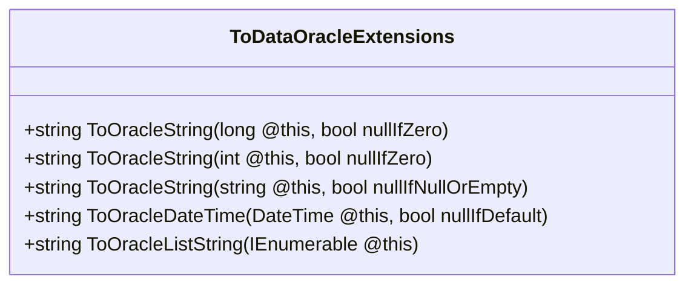

# ToDataOracleExtensions

**Namespace**: IsthmusWinthor.Dominio.Extensions  
**Nome do Arquivo**: ToDataOracleExtensions.cs  

## Visão Geral e Responsabilidade
A classe `ToDataOracleExtensions` é um conjunto de métodos de extensão que tem a finalidade de converter diferentes tipos de dados em formatos compatíveis com o banco de dados Oracle. Essa classe resolve o problema de formatação de dados para garantir que os valores sejam inseridos corretamente em consultas ao banco de dados, respeitando as regras de negócio sobre representação de valores nulos.

## Métodos de Negócio

### Método: ToOracleString(long, bool)
- **Objetivo**: Garante a conversão de um valor longo em uma string formatada para o Oracle. Se o valor for zero e a opção `nullIfZero` for verdadeira, retorna "NULL".
- **Comportamento**: 
  1. Verifica se `nullIfZero` é verdadeiro e se o valor é zero.
  2. Se a condição for verdadeira, retorna "NULL".
  3. Caso contrário, retorna o valor como uma string cercada por aspas simples.
- **Retorno**: Retorna uma string formatada ou "NULL".

### Método: ToOracleString(int, bool)
- **Objetivo**: Assim como o método anterior, garante a conversão de um inteiro em uma string compatível com o Oracle.
- **Comportamento**: 
  1. Verifica se `nullIfZero` é verdadeiro e se o valor é zero.
  2. Se a condição for verdadeira, retorna "NULL".
  3. Caso contrário, formata e retorna o valor como uma string cercada por aspas simples.
- **Retorno**: Retorna uma string formatada ou "NULL".

### Método: ToOracleString(string, bool)
- **Objetivo**: Converte uma string em um formato seguro para o Oracle. Se a string for vazia e a opção `nullIfNullOrEmpty` for verdadeira, retorna "NULL".
- **Comportamento**: 
  1. Verifica se `nullIfNullOrEmpty` é verdadeiro e a string está vazia ou nula.
  2. Se a condição for verdadeira, retorna "NULL".
  3. Caso contrário, remove aspas simples da string e retorna a string formatada.
- **Retorno**: Retorna a string formatada ou "NULL".

### Método: ToOracleDateTime(DateTime, bool)
- **Objetivo**: Converte um objeto `DateTime` em uma string formatada para uso no Oracle, respeitando a possibilidade de retorno de "NULL".
- **Comportamento**: 
  1. Verifica se o objeto é igual ao valor padrão (default) e se `nullIfDefault` é verdadeiro.
  2. Se a condição for verdadeira, retorna "NULL".
  3. Caso contrário, formata o objeto `DateTime` como uma string de data no formato apropriado.
- **Retorno**: Retorna a string formatada ou "NULL".

### Método: ToOracleListString(IEnumerable<string>)
- **Objetivo**: Converte uma lista de strings em uma representação formatada para uso no Oracle.
- **Comportamento**: 
  1. Para cada string na lista, adiciona aspas simples e forma uma nova lista.
  2. Une todas as strings formatadas com uma vírgula.
- **Retorno**: Retorna uma string que representa a lista formatada.

```mermaid
flowchart TD
    A[Início]
    B{nullIfZero?}
    C{Valor == 0?}
    D[Retorna "NULL"]
    E[Retorna valor formatado]
    A --> B
    B -->|true| C
    C -->|true| D
    C -->|false| E
    B -->|false| E
```

## Propriedades Calculadas e de Validação
- Não há propriedades calculadas ou de validação nesta classe, pois é composta apenas por métodos de extensão utilitários.

## Navigation Property
- Não há propriedades de navegação nesta classe, pois ela apenas fornece métodos de extensão.

## Tipos Auxiliares e Dependências
- Esta classe não possui tipos auxiliares ou dependências diretas a serem relatadas.

## Diagrama de Relacionamentos

