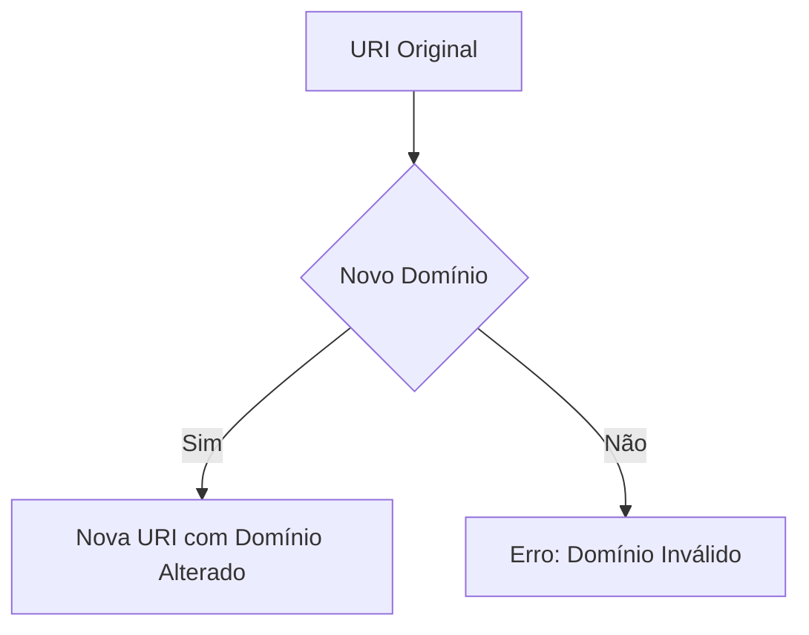
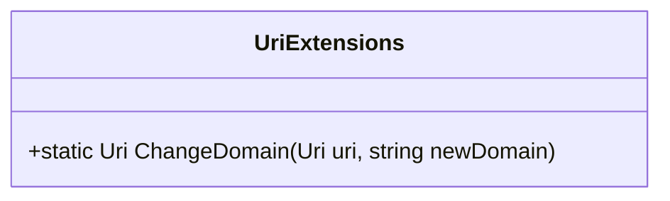

# UriExtensions
**Namespace**: IsthmusWinthor.Dominio.Extensions  
**Nome do Arquivo**: UriExtensions.cs  

## Visão Geral e Responsabilidade
A classe `UriExtensions` fornece extensões para a manipulação de URIs. Esta classe permite alterar o domínio de uma URI existente, preservando o caminho e a consulta, o que é útil na construção de novas URIs a partir de um domínio base alterado, simplificando a lógica de reconstrução de URIs nas interações de rede dentro de um sistema.

## Métodos de Negócio

### Título: ChangeDomain (static)
- **Objetivo**: Garante a capacidade de alterar facilmente o domínio de uma URI, permitindo operações dinâmicas em serviços que podem hospedar recursos em diferentes domínios.
- **Comportamento**:
  1. A função inicia recebendo uma URI existente e um novo domínio como argumentos.
  2. Ela extrai o caminho e a consulta da URI original.
  3. Um novo objeto `Uri` é criado utilizando o novo domínio e o caminho e consulta extraídos.
  4. O novo objeto `Uri` é retornado.
- **Retorno**: Retorna uma nova instância de `Uri` com o domínio alterado, mantendo a estrutura anterior intacta.

## Propriedades Calculadas e de Validação
N/A

## Navigations Property
N/A

## Tipos Auxiliares e Dependências
N/A

## Diagrama de Relacionamentos

---
Gerada em 29/12/2025 21:12:39
