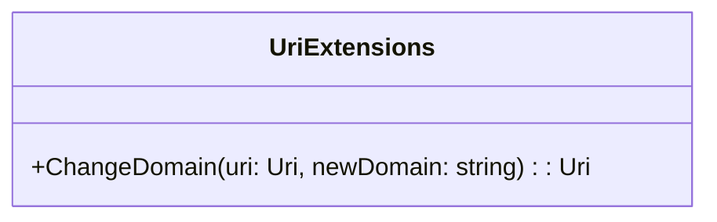

# UriExtensions
**Namespace**: IsthmusWinthor.Dominio.Extensions  
**Nome do Arquivo**: UriExtensions.cs  

## Visão Geral e Responsabilidade
A classe `UriExtensions` é uma classe estática que fornece uma extensão para o tipo `Uri`, permitindo alterar o domínio de um URI existente sem alterar o seu caminho e consulta. Esta funcionalidade é particularmente útil em cenários onde é necessário redirecionar requisições para um novo domínio enquanto mantém as informações do recurso inalteradas, garantindo a continuidade na navegação e integridade dos links.

## Métodos de Negócio

### Título: ChangeDomain (Público)
- **Objetivo**: Garante a alteração do domínio de um URI atual, preservando seu caminho e query strings.
- **Comportamento**:
  1. Extrai o caminho e a consulta do URI original usando a propriedade `PathAndQuery`.
  2. Cria um novo URI combinando o `newDomain` com o caminho e consulta extraídos.
  3. Retorna o novo URI criado.
- **Retorno**: Retorna um novo objeto `Uri` que representa o mesmo recurso do URI original, mas com o domínio atualizado.

## Propriedades Calculadas e de Validação
Não existem propriedades na classe `UriExtensions` que apresentem lógica de cálculo ou validação.

## Navigations Property
Não existem propriedades que sejam classes complexas do domínio nesta classe.

## Tipos Auxiliares e Dependências
Nenhum enumerador ou classe auxiliar dependente é utilizado nesta classe. 

## Diagrama de Relacionamentos

