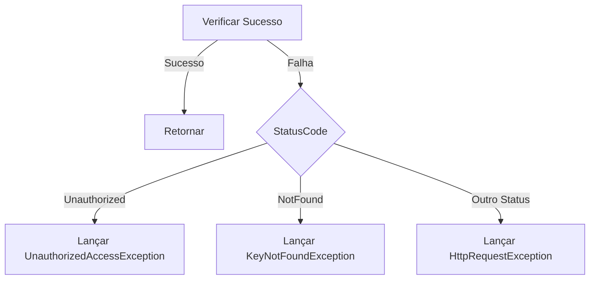
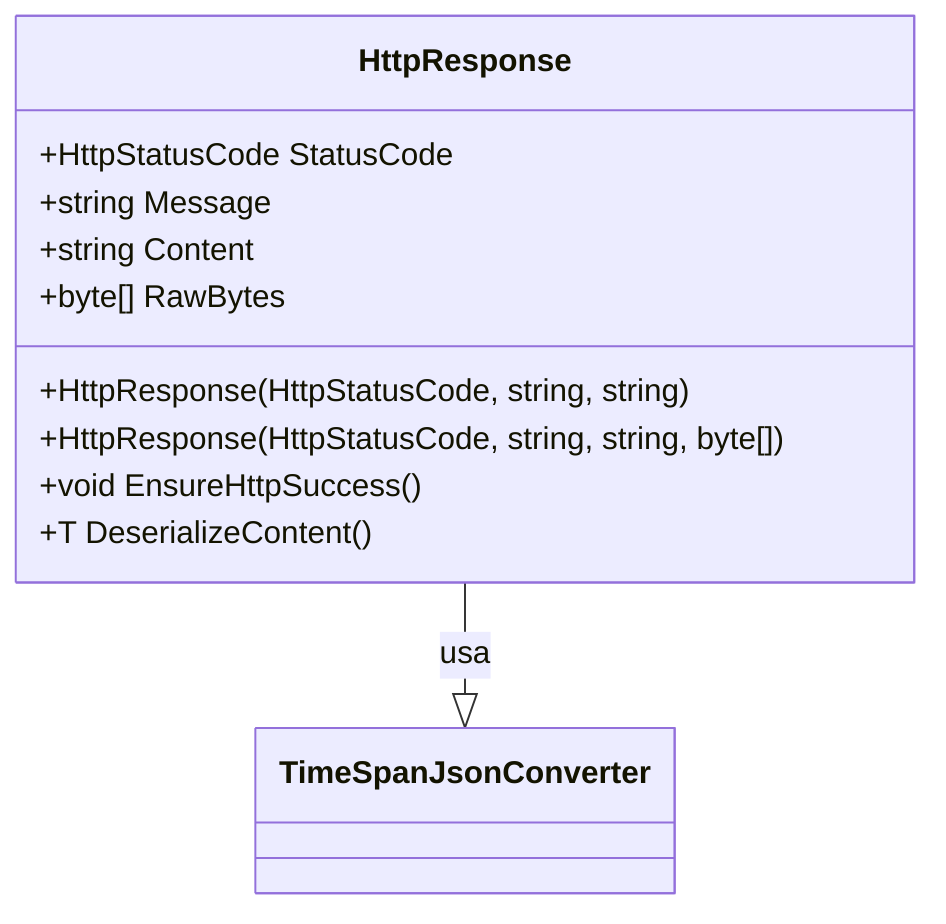

# HttpResponse

**Namespace**: IsthmusWinthor.Dominio  
**Nome do Arquivo**: HttpResponse.cs  

## Visão Geral e Responsabilidade

A classe `HttpResponse` atua como um motor de validação e manipulação dos dados de resposta HTTP em um ambiente corporativo. Ela encapsula o resultado de requisições HTTP, assegurando a integridade dos dados retornados e executando as validações necessárias para tratamento de respostas não-sucedidas. Esta classe é vital para garantir que o sistema lide corretamente com diferentes status de resposta HTTP, além de facilitar a desserialização do conteúdo das respostas.

## Métodos de Negócio

### EnsureHttpSuccess (Público)

- **Objetivo**: Garante que a resposta HTTP seja um sucesso, conforme os códigos de status HTTP.
- **Comportamento**:
  1. Converte o `StatusCode` em um inteiro.
  2. Verifica se o código de status indica sucesso (entre 100 e 399).
  3. Se não for bem sucedido, verifica se o status é `Unauthorized` e lança uma exceção específica.
  4. Caso o status seja `NotFound`, lança uma exceção de chave não encontrada.
  5. Para outros códigos de erro, lança uma exceção genérica de requisição HTTP.
- **Retorno**: Não retorna valor, mas lança exceções se a resposta não for bem-sucedida.

### DeserializeContent<T> (Público)

- **Objetivo**: Desserializa o conteúdo da resposta HTTP para um objeto do tipo especificado.
- **Comportamento**:
  1. Verifica se o conteúdo está vazio ou nulo.
  2. Se não, utiliza o `JsonSerializer` para desserializar o conteúdo, considerando insensibilidade a maiúsculas/minúsculas e conversões específicas (ex.: `TimeSpan`).
- **Retorno**: Retorna o objeto desserializado ou valor padrão se o conteúdo for inválido.

## Propriedades Calculadas e de Validação

- **Content**: Validado no construtor usando `ValidarContent` para remover aspas se o conteúdo não for um objeto ou coleção JSON.

## Navigations Property

Não se aplicam nesta classe.

## Tipos Auxiliares e Dependências

- **Enums**:
  - `HttpStatusCode` - Usado para representar o código de status HTTP.
- **Helpers**:
  - `[TimeSpanJsonConverter](TimeSpanJsonConverter.md)` - Conversor de JSON para `TimeSpan`.

## Diagrama de Relacionamentos

