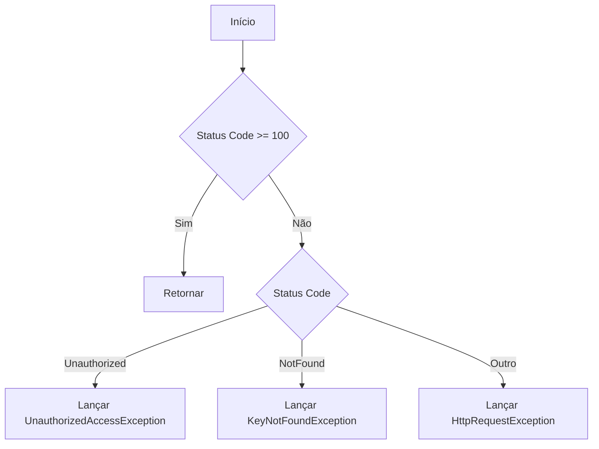

# HttpResponse

- **Namespace**: IsthmusWinthor.Dominio
- **Nome do Arquivo**: HttpResponse.cs

## Visão Geral e Responsabilidade
A classe `HttpResponse` representa a resposta de uma requisição HTTP, encapsulando o status da resposta, uma mensagem para o cliente, o conteúdo da resposta e bytes brutos (opcional). Sua principal responsabilidade é verificar a integridade e o sucesso da resposta HTTP, assegurando que os códigos de status sejam tratados conforme as regras de negócios esperadas para uma aplicação que consome APIs. Isso garante uma gestão robusta dos resultados das chamadas HTTP, facilitando o tratamento de erros e a deserialização de conteúdos.

## Métodos de Negócio

### EnsureHttpSuccess
- **Objetivo**: Garante que o status da resposta HTTP indica sucesso (códigos de 100 a 399). 
- **Comportamento**:
  1. Recupera o valor numérico do status code.
  2. Verifica se o status code está na faixa de sucesso (100 a 399).
  3. Se sim, a execução é finalizada sem exceções.
  4. Se não, verifica especificamente se o status code é `Unauthorized` ou `NotFound` para lançar exceções específicas.
  5. Para outros códigos de erro, lança uma `HttpRequestException` com a mensagem correspondente.



### DeserializeContent<T>
- **Objetivo**: Deserializa o conteúdo da resposta HTTP para o tipo especificado `T`.
- **Comportamento**:
  1. Verifica se o conteúdo é nulo ou em branco; se sim, retorna o valor padrão de `T`.
  2. Caso contrário, utiliza o `JsonSerializer` para deserializar o conteúdo, aplicando opções de case-insensitivity e conversores específicos.
- **Retorno**: Retorna o objeto do tipo `T` correspondente ao conteúdo deserializado ou o valor padrão, se o conteúdo for inválido.

## Propriedades Calculadas e de Validação

### Content
- Validação: A propriedade `Content` passa por validação no método `ValidarContent`, onde se o conteúdo não for um objeto ou coleção, aspas são removidas, garantindo que o conteúdo seja adequado para processamento posterior.

## Navigations Property
Não há propriedades que representem classes complexas do domínio.

## Tipos Auxiliares e Dependências
- **Enumeradores**:
  - [HttpStatusCode](https://learn.microsoft.com/en-us/dotnet/api/system.net.httpstatuscode?view=net-7.0)
- **Classes Estáticas/Helpers**:
  - [TimeSpanJsonConverter](TimeSpanJsonConverter.md)

## Diagrama de Relacionamentos
```mermaid
classDiagram
    class HttpResponse {
        +HttpStatusCode StatusCode
        +string Message
        +string Content
        +byte[] RawBytes
        +void EnsureHttpSuccess()
        +T DeserializeContent<T>()
    }
    HttpResponse ...> HttpStatusCode : uses
    HttpResponse ...> TimeSpanJsonConverter : uses
```
---
Gerada em 29/12/2025 20:05:03
