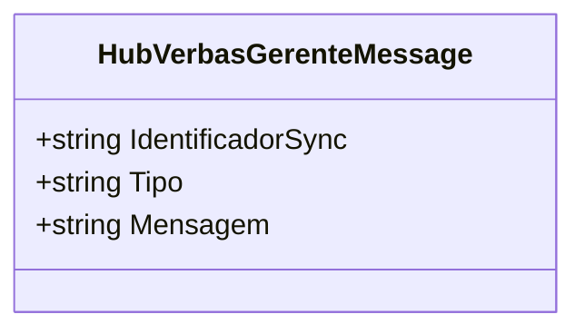

# HubVerbasGerenteMessage

**Namespace**: IsthmusWinthor.Dominio.Hubs  
**Nome do Arquivo**: HubVerbasGerenteMessage.cs  

## Visão Geral e Responsabilidade
A classe `HubVerbasGerenteMessage` é responsável por encapsular mensagens que serão enviadas através do Hub de comunicação para gerentes, gerando uma estrutura de dados que permite a troca eficiente de informações entre o servidor e os clientes conectados. Esta classe é fundamental para garantir que as mensagens contenham todas as informações necessárias, como identificador de sincronização, tipo e conteúdo da mensagem, assegurando que o sistema possa comunicar alterações ou notificações de maneira estruturada e confiável.

## Propriedades Calculadas e de Validação
As propriedades da classe são definidas apenas no construtor, e não possuem lógica de cálculo ou validação. Elas são utilizadas para transportar dados de forma integral.

## Navigations Property
Não existem Navigations Properties nesta classe.

## Tipos Auxiliares e Dependências
Não utiliza nenhum enumerador ou classe estática/helper.

## Diagrama de Relacionamentos

---

A classe `IHubVerbasGerente` serve como uma interface para criar um contrato de operação entre o servidor e os conectores, permitindo operações de adição de usuários e notificações. Entretanto, como se trata de uma interface, não é necessário documentar suas regras de negócio ou propriedades detalhadamente, pois não contém implementações concretas.
