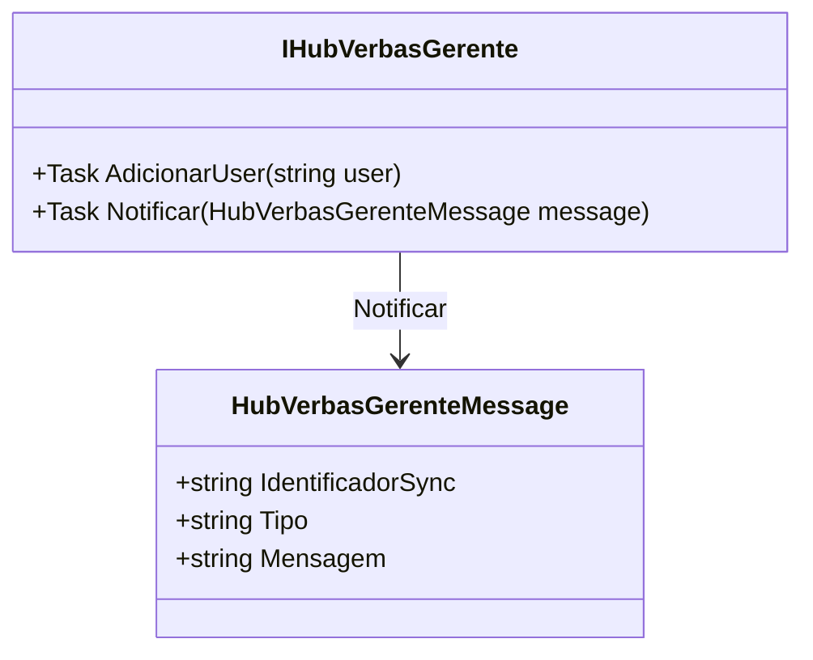

# HubVerbasGerenteMessage
**Namespace**: IsthmusWinthor.Dominio.Hubs  
**Nome do Arquivo**: HubVerbasGerenteMessage.cs  

HubVerbasGerenteMessage é uma classe que serve como um modelo de transporte de dados, destinada à interação entre o servidor e os clientes em um contexto de comunicação em tempo real, como um hub do SignalR. Ela encapsula informações relevantes que serão enviadas e recebidas pelas partes envolvidas.

## Propriedades Calculadas e de Validação
- **IdentificadorSync**: Identifica de maneira única cada mensagem, garantindo que as interações possam ser acompanhadas e monitoradas sem ambiguidade.
- **Tipo**: Denota a categoria da mensagem, permitindo o tratamento adequado conforme o tipo de notificação que se deseja enviar ou receber.
- **Mensagem**: Contém o conteúdo da notificação que será apresentada ao usuário ou processado pelo sistema.

---

# IHubVerbasGerente
**Namespace**: IsthmusWinthor.Dominio.Hubs  
**Nome do Arquivo**: IHubVerbasGerente.cs  

IHubVerbasGerente é uma interface que define as operações que um hub de gerenciamento de verbas deve expor. Essa interface é crucial para garantir que as implementações sigam um contrato claro para a adição de usuários e a notificação de mensagens.

## Métodos de Negócio
### 1. AdicionarUser (public)
- **Objetivo**: Garante que um usuário seja adicionado ao hub, permitindo a ele receber atualizações pertinentes em tempo real.
- **Comportamento**: 
    1. Recebe o identificador de um usuário como parâmetro.
    2. Adiciona o usuário à lista de usuários conectados ao hub.
    3. Prepara o hub para enviar atualizações futuras ao usuário adicionado.
- **Retorno**: Este método é assíncrono e não retorna um valor específico, mas sua execução resulta na adição do usuário ao hub.

### 2. Notificar (public)
- **Objetivo**: Garante que uma mensagem seja entregue a todos os usuários conectados ao hub.
- **Comportamento**: 
    1. Recebe uma instância de `HubVerbasGerenteMessage` como parâmetro, que contém os dados a serem enviados.
    2. Processa a mensagem e distribui para todos os usuários conectados.
- **Retorno**: Este método é assíncrono e não retorna um valor específico, mas garante que todos os usuários recebam a notificação.

---

## Navigations Property
Atualmente, esta classe não possui propriedades que represente classes complexas do domínio.

## Tipos Auxiliares e Dependências
- **Externos**:
  - `Newtonsoft.Json`: Necessário para a serialização/deserialização JSON utilizada na classe.
- **Delimitadores**:
  - `Task`: Usado para representação de métodos assíncronos.

---

## Diagrama de Relacionamentos

---
Gerada em 29/12/2025 21:12:53
