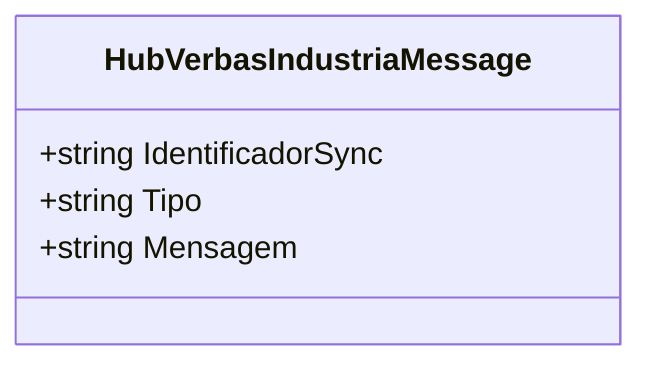

# HubVerbasIndustriaMessage

**Namespace**: IsthmusWinthor.Dominio.Hubs  
**Nome do Arquivo**: HubVerbasIndustriaMessage.cs  

## Visão Geral e Responsabilidade
A classe `HubVerbasIndustriaMessage` é responsável por encapsular as mensagens que serão enviadas pelo hub de comunicação da aplicação. Este hub opera em um contexto onde é necessário trocar informações entre usuários e partes do sistema, garantindo que as mensagens sejam transportadas de forma consistente e estruturada. O problema de negócio que essa classe resolve é a necessidade de uma comunicação eficiente e organizada entre componentes do sistema, permitindo que os usuários recebam notificações pertinentes de uma maneira padronizada.

## Propriedades Calculadas e de Validação
- **IdentificadorSync**: Parte da mensagem que assegura a unicidade de uma comunicação específica no sistema. Este identificador é crucial para rastreamento e garantias de entrega.
- **Tipo**: Indica a natureza da mensagem (por exemplo, se é uma notificação de erro, sucesso, etc.). Isso permite que os consumidores da mensagem tratem adequadamente as informações recebidas.
- **Mensagem**: O conteúdo principal da mensagem, que detalha o que precisa ser comunicado. É através dessa propriedade que a informação relevante é transmitida.

## Tipos Auxiliares e Dependências
- Nenhum tipo auxiliar ou enumerador específico é utilizado diretamente nesta classe.

## Diagrama de Relacionamentos

Neste diagrama, a classe `HubVerbasIndustriaMessage` é representada com suas propriedades, refletindo sua estrutura interna e a natureza dos dados que ela transporta. Como é uma classe simples e não possui relações complexas ou dependências externas, o diagrama não contém associações ou composições adicionais.
