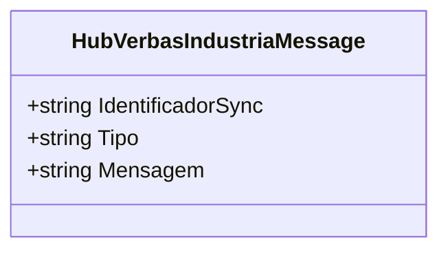
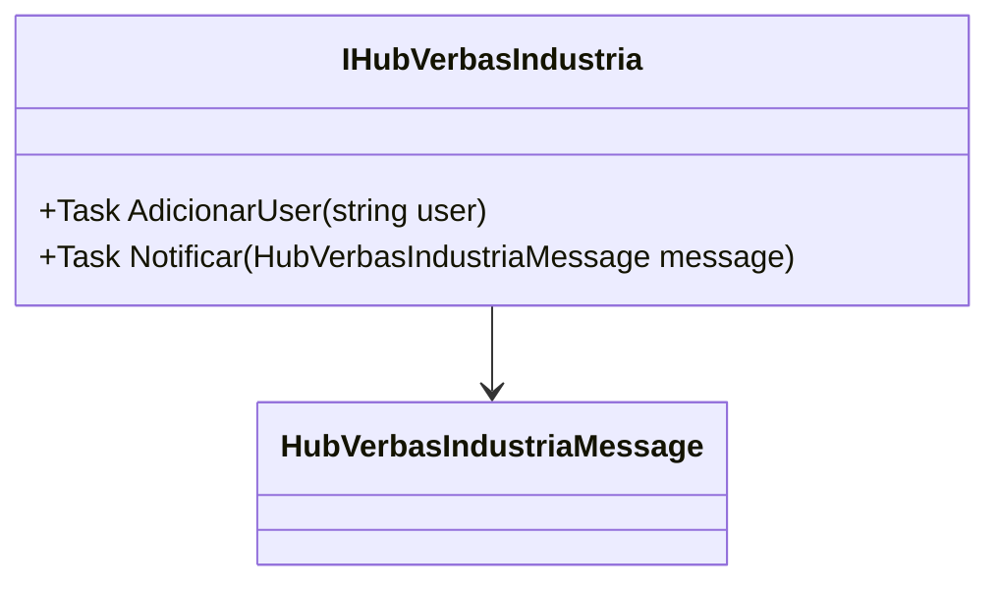

# HubVerbasIndustriaMessage

**Namespace**: IsthmusWinthor.Dominio.Hubs  
**Nome do Arquivo**: HubVerbasIndustriaMessage.cs

## Visão Geral e Responsabilidade
A classe `HubVerbasIndustriaMessage` encapsula mensagens que serão enviadas através de um hub industrial, servindo como um mecanismo de comunicação entre diferentes partes de um sistema. Essa classe resolve o problema de transporte de informações relacionadas ao estado e tipo de mensagens que o sistema de indústria pode gerar, garantindo que a comunicação seja estruturada e coerente.

## Métodos de Negócio
A classe é um simples DTO (Data Transfer Object) e não contém lógica de negócio complexa.

## Propriedades Calculadas e de Validação
- A classe contém três propriedades somente leitura: 
  - `IdentificadorSync`: Identificador único para o sincronismo da mensagem.
  - `Tipo`: Categoria ou tipo da mensagem.
  - `Mensagem`: O conteúdo da mensagem a ser transmitida.
  
Essas propriedades garantem a integridade e a clareza das mensagens enviadas.

## Navigations Property
A classe `HubVerbasIndustriaMessage` não possui propriedades complexas do domínio, pois sua função é meramente transportar dados.

## Tipos Auxiliares e Dependências
- Sem enumeradores ou classes auxiliares dependentes.

## Diagrama de Relacionamentos

---

# IHubVerbasIndustria

**Namespace**: IsthmusWinthor.Dominio.Hubs  
**Nome do Arquivo**: IHubVerbasIndustria.cs

## Visão Geral e Responsabilidade
A interface `IHubVerbasIndustria` define a estrutura para a interação com o hub de comunicação do sistema, fornecendo métodos que garantem a adição de usuários às notificações e o envio de mensagens. A responsabilidade principal dessa interface é assegurar que os serviços de hub possam ser implementados de forma consistente, permitindo a comunicação entre componentes do sistema com base em eventos e mensagens.

## Métodos de Negócio

### Título: `AdicionarUser` (Visibilidade: `public`)
- **Objetivo**: Garante que um usuário seja adicionado ao hub, permitindo que ele receba mensagens e notificações.
- **Comportamento**:
  1. Recebe uma string `user` que representa o usuário a ser adicionado.
  2. Realiza a operação de adição na implementação concreta do hub (a lógica exata não está definida na interface).
- **Retorno**: Método assíncrono (`Task`), não retorna nenhum valor, mas implica a atualização do estado do hub.

### Título: `Notificar` (Visibilidade: `public`)
- **Objetivo**: Garante que uma mensagem seja enviada a todos os usuários conectados ao hub. Facilita a comunicação em tempo real entre o sistema e os usuários.
- **Comportamento**:
  1. Recebe um objeto `HubVerbasIndustriaMessage`, que contém as informações necessárias da mensagem a ser enviada.
  2. A implementação deve processar essa mensagem e distribuí-la para os usuários conectados.
- **Retorno**: Método assíncrono (`Task`), não retorna nenhum valor, mas assegura que a mensagem seja tratada e distribuída.

## Propriedades Calculadas e de Validação
A interface não possui propriedades.

## Navigations Property
A interface não possui propriedades complexas do domínio.

## Tipos Auxiliares e Dependências
- Classe `HubVerbasIndustriaMessage` (para o tipo de mensagem que é enviada).

## Diagrama de Relacionamentos

---
Gerada em 29/12/2025 21:13:11
