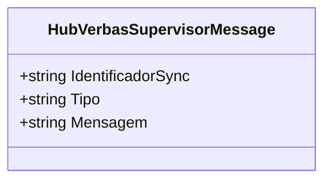

# HubVerbasSupervisorMessage

**Namespace**: IsthmusWinthor.Dominio.Hubs  
**Nome do Arquivo**: HubVerbasSupervisorMessage.cs  

## Visão Geral e Responsabilidade
A classe `HubVerbasSupervisorMessage` atua como um modelo de mensagem que é utilizado para passar informações sobre eventos relevantes ocorrendo em um hub de comunicação de um sistema. Esta classe encapsula dados como identificadores, tipo de evento e a mensagem correspondente, facilitando a comunicação eficiente entre diferentes partes do sistema em tempo real.

## Métodos de Negócio
### Título: Construtor (Visibilidade: Público)
- **Objetivo**: Garante a construção de um objeto que contém os dados essenciais para uma mensagem a ser transmitida através do hub.
- **Comportamento**: 
  1. O construtor recebe três parâmetros: `identificadorSync`, `tipo` e `mensagem`.
  2. Cada parâmetro é atribuído à propriedade correspondente, que são somente leitura e devem ser informadas devido às suas naturezas necessárias para a mensagem.
- **Retorno**: Não retorna valor, apenas instancia um objeto `HubVerbasSupervisorMessage` que contém os valores fornecidos.

## Propriedades Calculadas e de Validação
- `IdentificadorSync`: Este valor é utilizado para garantir que a mensagem possa ser identificada de forma única e sincronizada em diferentes partes do sistema.
- `Tipo`: Define o tipo do evento que a mensagem está representando, sendo crucial para a manipulação correta da mensagem em funções posteriores.
- `Mensagem`: O conteúdo da mensagem, que oferece o contexto necessário para o evento que está sendo notificado.

## Navigations Property
- Não existem propriedades que sejam classes complexas do domínio nesta classe.

## Tipos Auxiliares e Dependências
- Nenhum enumeration ou classe estática/helper é utilizada diretamente na classe.

## Diagrama de Relacionamentos

---
Gerada em 29/12/2025 21:13:21
