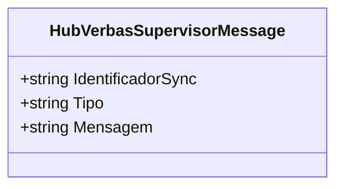
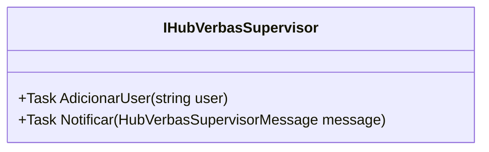

# HubVerbasSupervisorMessage

**Namespace**: IsthmusWinthor.Dominio.Hubs  
**Nome do Arquivo**: HubVerbasSupervisorMessage.cs  

## Visão Geral e Responsabilidade
A classe `HubVerbasSupervisorMessage` é responsável por encapsular as mensagens que serão enviadas através do hub para supervisores relacionados a verbas. O objetivo é proporcionar um meio estruturado de comunicação que inclui um identificador único, um tipo de mensagem e o conteúdo da mensagem. Essa classe atende ao problema de comunicação eficiente e organiza as informações necessárias para que supervisores possam responder ou tomar ações pertinentes com base nas notificações recebidas.

## Propriedades Calculadas e de Validação
Não existem propriedades com lógica no `get` ou validação no `set` nesta classe, pois as propriedades estão diretamente ligadas aos valores passados no construtor e são somente leitura.

## Navigations Property
Não existem propriedades que são classes complexas do domínio nesta classe.

## Tipos Auxiliares e Dependências
Não existem enumeradores, classes estáticas ou helpers utilizados.

## Diagrama de Relacionamentos

---

# IHubVerbasSupervisor

**Namespace**: IsthmusWinthor.Dominio.Hubs  
**Nome do Arquivo**: IHubVerbasSupervisor.cs  

## Visão Geral e Responsabilidade
A interface `IHubVerbasSupervisor` define o contrato para operações relacionadas à comunicação com usuários em um hub. Ela é crucial para a implementação de uma funcionalidade robusta de notificação e gerenciamento de usuários dentro da aplicação. A interface é projetada para permitir que qualquer classe que a implemente possa adicionar usuários e enviar notificações de forma assíncrona.

## Métodos de Negócio

### AdicionarUser (public)
- **Objetivo:** Este método garante que um novo usuário seja adicionado ao contexto do hub.
- **Comportamento:** 
  1. Recebe uma string que representa o usuário a ser adicionado.
  2. O método deve conectar o usuário ao hub especificado.
- **Retorno:** Retorna uma `Task`, sinalizando a conclusão da operação no contexto assíncrono.

### Notificar (public)
- **Objetivo:** Este método assegura que uma notificação seja enviada a todos os usuários conectados ao hub.
- **Comportamento:**
  1. Recebe um objeto `HubVerbasSupervisorMessage` que contém a mensagem a ser transmitida.
  2. A mensagem é formatada e convertida para um formato adequado para transporte.
  3. Em seguida, é distribuída para todos os usuários conectados ao hub que estão escutando por este tipo de mensagem.
- **Retorno:** Retorna uma `Task`, sinalizando a conclusão da operação no contexto assíncrono.

## Propriedades Calculadas e de Validação
Não aplicável, pois a interface não possui propriedades.

## Navigations Property
Não existem propriedades que são classes complexas do domínio nesta interface.

## Tipos Auxiliares e Dependências
Não existem enumeradores, classes estáticas ou helpers utilizados.

## Diagrama de Relacionamentos

Neste formato, a documentação dos dois componentes apresentados fornece uma visão clara e estruturada sobre suas responsabilidades e comportamentos, facilitando a compreensão e manutenção do sistema.
