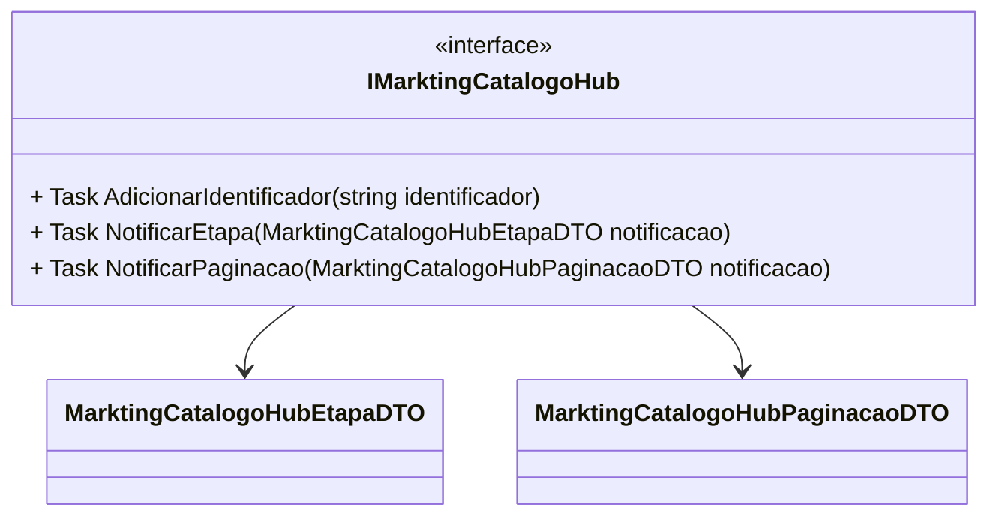

# IMarktingCatalogoHub
**Namespace**: IsthmusWinthor.Dominio.Hubs  
**Nome do Arquivo**: IMarktingCatalogoHub.cs  

Este arquivo define a interface `IMarktingCatalogoHub`, que é responsável pelo transporte de dados relativos ao catálogo de marketing.  

---

### Métodos de Negócio

#### Título: `AdicionarIdentificador` (Visibilidade: `Task`)
- **Objetivo**: Este método garante que um identificador único seja adicionado ao sistema, permitindo a rastreabilidade e identificação de elementos no catálogo de marketing.
- **Comportamento**: 
  1. O método recebe um parâmetro do tipo string, que representa o identificador a ser adicionado.
  2. Uma lógica interna valida se o identificador está em um formato adequado (não abordado aqui, pois a lógica específica não está definida).
  3. O sistema armazena ou registra o identificador sob as regras definidas, prontos para serem utilizados posteriormente em outras ações.
- **Retorno**: Não retorna valor, pois seu propósito principal é a execução da ação de adicionar o identificador.

#### Título: `NotificarEtapa` (Visibilidade: `Task`)
- **Objetivo**: Este método notifica o sistema sobre a mudança de etapa no processo do catálogo de marketing.
- **Comportamento**: 
  1. O método espera receber um objeto do tipo `MarktingCatalogoHubEtapaDTO`, que contém informações sobre a etapa do processo.
  2. Após receber a notificação, o sistema deve processar e aplicar as mudanças necessárias relacionadas à nova etapa.
  3. A notificação permite que outros componentes do sistema reajam a mudanças de estado no fluxo do catálogo.
- **Retorno**: Não retorna valor, já que é uma operação de notificação.

#### Título: `NotificarPaginacao` (Visibilidade: `Task`)
- **Objetivo**: Este método é responsável por notificar o sistema sobre a necessidade de paginar os itens de um catálogo.
- **Comportamento**: 
  1. Recebe um objeto do tipo `MarktingCatalogoHubPaginacaoDTO`, que contém informações sobre a página solicitada e a estrutura de dados a ser apresentada.
  2. O sistema utiliza essas informações para aplicar as mudanças necessárias na interface ou lógica de apresentação dos dados do catálogo.
  3. Permite que a aplicação suporte a visualização e navegação fluida entre grandes quantidades de dados.
- **Retorno**: Não retorna valor, pois trata-se de uma execução que realiza uma notificação.

### Propriedades Calculadas e de Validação
Nenhuma propriedade com lógica ou validação foi identificada nesta interface.

### Navigations Property
Nenhuma propriedade de navegação que represente classes complexas do domínio foi identificada nesta interface.

### Tipos Auxiliares e Dependências
- `MarktingCatalogoHubEtapaDTO`
- `MarktingCatalogoHubPaginacaoDTO`

### Diagrama de Relacionamentos

---
Gerada em 29/12/2025 21:13:34
