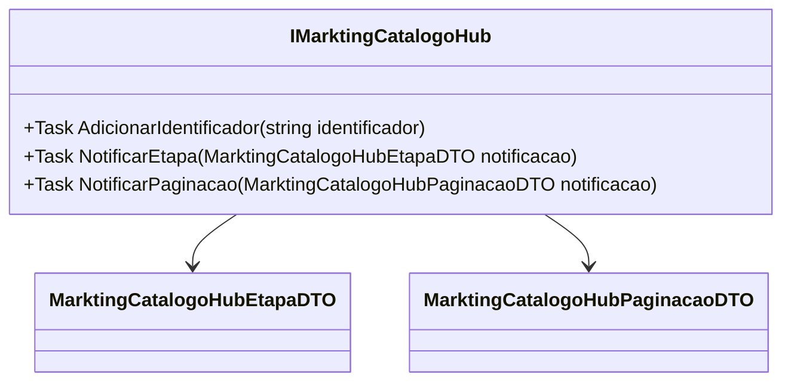

# IMarktingCatalogoHub
**Namespace**: IsthmusWinthor.Dominio.Hubs  
**Nome do Arquivo**: IMarktingCatalogoHub.cs  

Este é um contrato para comunicação via Hub em um sistema, facilitando a troca de informações relacionadas ao catálogo de marketing.

## Métodos de Negócio

### Título: `AdicionarIdentificador` - `Task`
- **Objetivo**: Este método garante a adição de um identificador ao contexto do catálogo de marketing, possibilitando o rastreamento e a identificação de itens relevantes na plataforma.
- **Comportamento**: 
  1. Recebe um `string` representando o identificador a ser adicionado.
  2. O identificador é processado e armazenado em uma estrutura de dados apropriada para uso posterior.
  3. Caso o identificador já exista, o sistema deve garantir que não ocorra duplicação, embora esse controle não esteja explicitamente descrito no método.
- **Retorno**: Não retorna valor, mas pode lançar exceções em casos de erro (ex.: identificador inválido).

### Título: `NotificarEtapa` - `Task`
- **Objetivo**: Garante a notificação de etapas específicas no fluxo de operação do catálogo de marketing, permitindo que os clientes em tempo real sejam informados sobre atualizações.
- **Comportamento**: 
  1. Recebe um objeto do tipo `MarktingCatalogoHubEtapaDTO`.
  2. O método deve processar a notificação e enviá-la para todos os clientes conectados ao Hub.
  3. A implementação deve assegurar que a notificação seja entregue de forma confiável.
- **Retorno**: Não retorna valor, mas pode envolver lógica de erro se a notificação falhar.

### Título: `NotificarPaginacao` - `Task`
- **Objetivo**: Este método assegura a notificação de atualizações em caso de paginação dos dados do catálogo de marketing, assim permitindo que os clientes atualizem suas interfaces de forma adequada.
- **Comportamento**: 
  1. Recebe um objeto do tipo `MarktingCatalogoHubPaginacaoDTO` contendo informações sobre a nova configuração de paginação.
  2. Processa a notificação e a envia a todos os clientes conectados, atualizando suas visualizações conforme necessário.
  3. O método deve garantir que os dados de paginação sejam precisos e que todos os clientes recebam as atualizações.
- **Retorno**: Não retorna valor, mas pode gerar exceções em caso de falhas na notificação.

## Navigations Property
- Não há propriedades complexas do domínio nesta interface.

## Tipos Auxiliares e Dependências
- `[MarktingCatalogoHubEtapaDTO](MarktingCatalogoHubEtapaDTO.md)`
- `[MarktingCatalogoHubPaginacaoDTO](MarktingCatalogoHubPaginacaoDTO.md)`

## Diagrama de Relacionamentos

Este diagrama ilustra a relação da interface `IMarktingCatalogoHub` com os tipos auxiliares `MarktingCatalogoHubEtapaDTO` e `MarktingCatalogoHubPaginacaoDTO`, que são essenciais para as suas operações de notificação.
