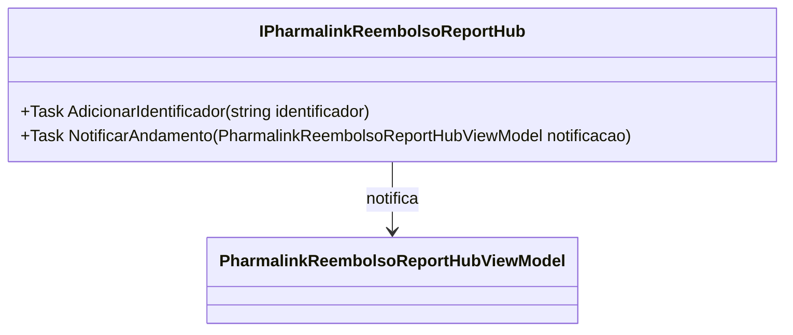

# IPharmalinkReembolsoReportHub
**Namespace**: IsthmusWinthor.Dominio.Hubs  
**Nome do Arquivo**: IPharmalinkReembolsoReportHub.cs  

Esta interface tem como finalidade a definição de métodos para interagir com o relatório de reembolso do Pharmalink, permitindo que diferentes partes do sistema se inscrevam para receber notificações e atualizações.

---

### Métodos de Negócio

#### Título: AdicionarIdentificador (Task)
- **Objetivo**: Este método permite adicionar um identificador relacionado ao processo de reembolso. Isso assegura que cada operação de reembolso possa ser rastreada de maneira única.
- **Comportamento**: O método recebe um parâmetro `identificador` que é passado para o sistema. A implementação deverá garantir que esse identificador é válido e está associado a um contexto de reembolso.
- **Retorno**: Não há retorno esperado; o método simplesmente executa a operação de adicionar o identificador ao sistema.

#### Título: NotificarAndamento (Task)
- **Objetivo**: Este método é responsável por notificar as partes interessadas sobre o andamento do processo de reembolso através do recebimento de um modelo de notificação.
- **Comportamento**: O método recebe um objeto `PharmalinkReembolsoReportHubViewModel` que contém informações sobre o andamento do reembolso. A implementação precisa garantir que a notificação atinja todos os assinantes do hub.
- **Retorno**: Não há retorno esperado; o método executa uma notificação nas partes interessadas sobre o andamento do reembolso.

---

### Navigations Property
Não há propriedades de navegação nesta interface, pois ela é composta apenas por métodos.

---

### Tipos Auxiliares e Dependências

- `[PharmalinkReembolsoReportHubViewModel](PharmalinkReembolsoReportHubViewModel.md)`

---

### Diagrama de Relacionamentos

Este documento fornece um detalhamento claro sobre a interface `IPharmalinkReembolsoReportHub`, suas responsabilidades e interações, permitindo uma visão abrangente do seu papel no sistema de reembolso do Pharmalink.
