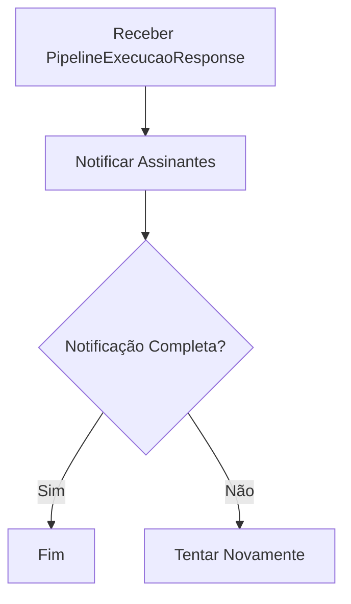
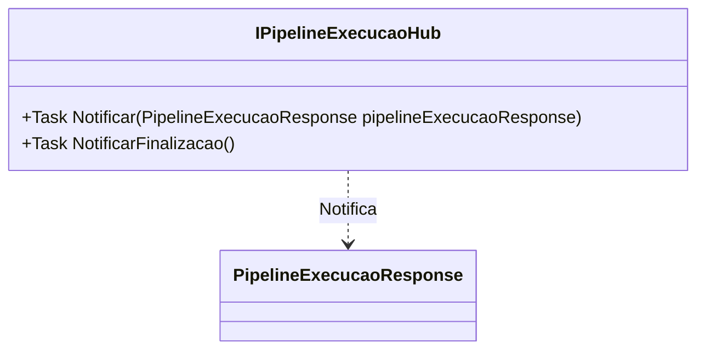

# IPipelineExecucaoHub
**Namespace**: IsthmusWinthor.Dominio.Hubs  
**Nome do Arquivo**: IPipelineExecucaoHub.cs  

Este arquivo define uma interface que tem como finalidade o transporte de dados relacionados à execução de pipelines dentro do domínio da aplicação.

---

### Visão Geral e Responsabilidade
A interface `IPipelineExecucaoHub` atua como um meio de comunicação assíncrona, permitindo notificações sobre o estado de execução de pipelines em tempo real. Ela resolve o problema de sincronização e feedback para os consumidores do sistema, garantindo que eventos importantes de execução sejam adequadamente divulgados.

### Métodos de Negócio

#### Título: Notificar (público)
- **Objetivo**: Garantir que as atualizações sobre a execução do pipeline sejam comunicadas aos interessados de forma assíncrona.
- **Comportamento**: 
  1. Recebe um objeto do tipo `PipelineExecucaoResponse` que contém dados sobre o estado atual da execução do pipeline.
  2. Notifica todos os assinantes ou interessados com a nova informação.
- **Retorno**: Retorna uma `Task`, indicando a conclusão da operação de notificação.

#### Título: NotificarFinalizacao (público)
- **Objetivo**: Notificar os interessados sobre a finalização da execução do pipeline.
- **Comportamento**: 
  1. Aciona um evento que indica que o processo de execução do pipeline foi concluído.
  2. Permite que os usuários reajam a essa finalização, por exemplo, liberando recursos ou atualizando o estado da interface.
- **Retorno**: Retorna uma `Task`, indicando a conclusão da operação de notificação.

### Propriedades Calculadas e de Validação
Não há propriedades definidas nesta interface, pois essa estrutura é utilitária e não contém dados persitentes ou computações com lógica.

### Navigations Property
Não há propriedades complexas do domínio definidas nesta interface.

### Tipos Auxiliares e Dependências
- **Dependências**: 
  - `PipelineExecucaoResponse` - Tipo que transporta os dados referentes ao estado da execução do pipeline.
  
  [PipelineExecucaoResponse](../DTO/Pipelines/PipelineExecucaoResponse.md)

### Diagrama de Relacionamentos

---
Gerada em 29/12/2025 21:13:49
