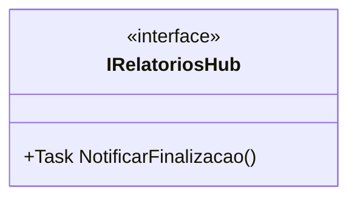

# IRelatoriosHub
- **Namespace**: IsthmusWinthor.Dominio.Hubs
- **Nome do Arquivo**: IRelatoriosHub.cs

**Citação**: Interface responsável por definir métodos para a notificação de finalização de relatórios.

### Propriedades Calculadas e de Validação
Não existem propriedades na interface IRelatoriosHub que realizem cálculos ou validações.

### Navigations Property
Não existem propriedades de navegação na interface IRelatoriosHub.

### Tipos Auxiliares e Dependências
Não há tipos auxiliares, enumeradores ou classes estáticas/Helpers diretamente utilizados nesta interface.

### Diagrama de Relacionamentos

---
Gerada em 29/12/2025 21:13:53
