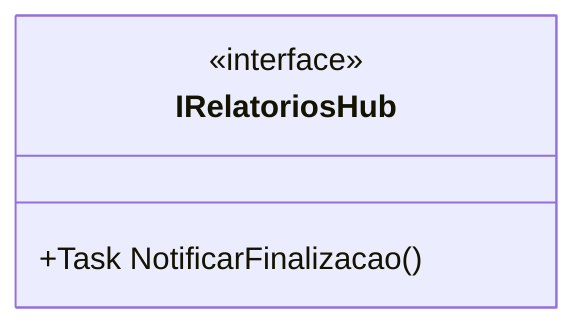

# IRelatoriosHub
**Namespace**: IsthmusWinthor.Dominio.Hubs  
**Nome do Arquivo**: IRelatoriosHub.cs  

## Visão Geral e Responsabilidade
A interface `IRelatoriosHub` representa um contrato para a notificação dos consumidores sobre a finalização de relatórios no sistema. Ela é um componente fundamental para a arquitetura de comunicação em tempo real, permitindo que diversas partes do sistema sejam informadas assim que um processo de geração de relatório é concluído, garantindo assim a atualização e integração dos dados entre diferentes módulos.

## Métodos de Negócio

### Título: NotificarFinalizacao
- **Visibilidade**: Público
- **Objetivo**: Garantir que todos os clientes conectados sejam notificados quando a geração de um relatório é finalizada. Essa notificação é crucial para que as partes interessadas possam tomar ações oportunas em resposta ao término do processamento.
- **Comportamento**: 
   1. O método `NotificarFinalizacao` é chamado quando um relatório é finalizado. 
   2. Ele dispara uma notificação através do hub de comunicação, permitindo que todos os clientes registrados recebam a atualização.
   3. Os clientes, ao receber a notificação, podem reagir de forma apropriada, como atualizando a interface do usuário ou iniciando novas ações relacionadas ao relatório.
- **Retorno**: Este método retorna um `Task`, representando a operação assíncrona de notificação, mas não retorna um valor significativo em si.

## Propriedades Calculadas e de Validação
Nenhuma propriedade calculada ou de validação foi identificada na interface `IRelatoriosHub`, uma vez que ela apenas define um comportamento e não possui propriedades.

## Navigations Property
Nenhuma propriedade complexa de domínio foi identificada na interface `IRelatoriosHub`.

## Tipos Auxiliares e Dependências
Nenhum enumerador ou classe estática/utilitária foi identificado como dependência da interface `IRelatoriosHub`.

## Diagrama de Relacionamentos

Essa documentação visa proporcionar uma compreensão clara das responsabilidades e do funcionamento da interface `IRelatoriosHub`, assegurando que os desenvolvedores saibam como ela se integra ao restante da aplicação no contexto da comunicação em tempo real.
