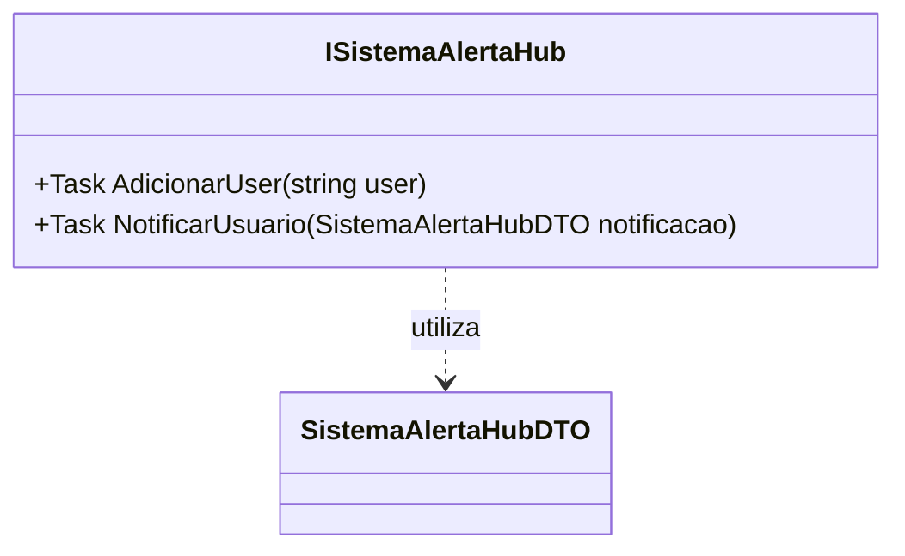

# ISistemaAlertaHub
- **Namespace**: IsthmusWinthor.Dominio.Hubs
- **Nome do Arquivo**: ISistemaAlertaHub.cs

## Visão Geral e Responsabilidade
A interface `ISistemaAlertaHub` define as operações de comunicação necessárias para a notificação de usuários dentro do sistema. Ela é responsável por permitir que o sistema envie alertas em tempo real, garantindo que os usuários sejam atualizados sobre eventos importantes. A implementação dessa interface serve ao problema de negócio de disponibilizar um canal eficiente de comunicação, essencial para manter os usuários informados e engajados.

## Métodos de Negócio

### 1. `AdicionarUser` - Visibilidade: `Task`
- **Objetivo**: Registra um novo usuário no sistema de notificações.
- **Comportamento**: 
  1. Recebe o nome do usuário como argumento.
  2. Adiciona o usuário à lista de recebedores de notificações.
  3. Confirma a adição ao usuário.
- **Retorno**: Este método retorna uma `Task`, indicando uma operação assíncrona que, ao ser completada, significa que o usuário foi adicionado corretamente.

### 2. `NotificarUsuario` - Visibilidade: `Task`
- **Objetivo**: Envia uma notificação específica para um usuário já registrado.
- **Comportamento**: 
  1. Recebe um objeto do tipo `SistemaAlertaHubDTO` que contém os detalhes da notificação a ser enviada.
  2. Localiza o usuário correspondente em sua lista de usuários registrados.
  3. Processa a notificação e a envia ao usuário.
  4. Informa o sistema se a notificação foi enviada com sucesso ou se houve falha.
- **Retorno**: Este método retorna uma `Task`, indicando que a operação é assíncrona e a finalização da tarefa representa o envio da notificação.

## Propriedades Calculadas e de Validação
- Não há propriedades calculadas ou de validação nesta interface, pois ela apenas define métodos sem estado.

## Navigations Property
- Não há propriedades de navegação ou classes complexas do domínio nesta interface.

## Tipos Auxiliares e Dependências
- `SistemaAlertaHubDTO`: Representa a estrutura de dados utilizada para as notificações enviadas através do `NotificarUsuario`.

## Diagrama de Relacionamentos

