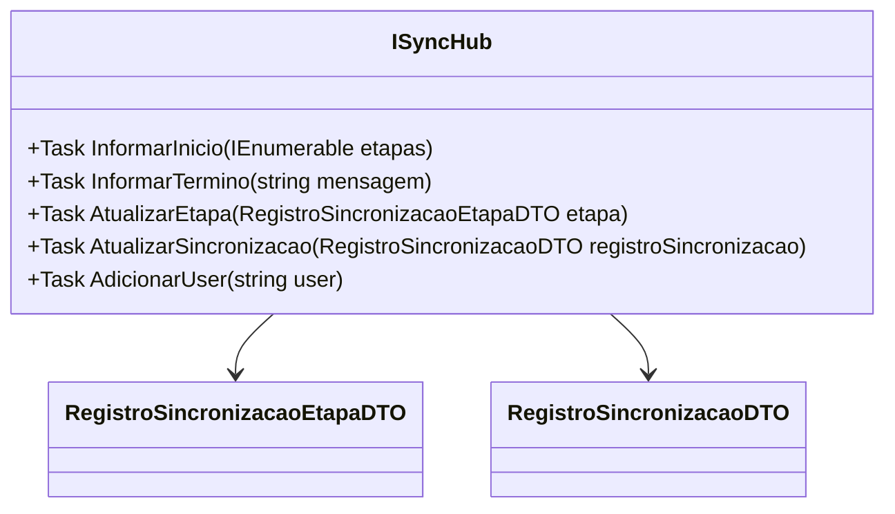

# ISyncHub
- **Namespace**: IsthmusWinthor.Dominio.Hubs
- **Nome do Arquivo**: ISyncHub.cs

> Esta interface é responsável pelo transporte de dados e comunicações relativas à sincronização dentro do sistema.

### Visão Geral e Responsabilidade
A interface `ISyncHub` serve como um contrato para operações relacionadas à sincronização de etapas e registros dentro do sistema. Ela permite a comunicação em tempo real entre o servidor e os clientes conectados, facilitando a atualização do estado da sincronização e a notificação dos usuários sobre progresso e conclusão. Através dela, a aplicação mantém os usuários informados sobre a execução de sincronizações, permitindo uma gestão mais eficiente e responsiva das operações.

### Métodos de Negócio

#### 1. InformarInicio
- **Visibilidade**: `Task InformarInicio(IEnumerable<RegistroSincronizacaoEtapaDTO> etapas)`
- **Objetivo**: Este método garante que os clientes sejam notificados sobre o início de uma nova etapa de sincronização, iniciando o fluxo de informações para os usuários.
- **Comportamento**: 
  1. Recebe uma coleção de objetos `RegistroSincronizacaoEtapaDTO` representando as etapas da sincronização.
  2. Notifica todos os clientes conectados que o processo de sincronização começou, fornecendo detalhes das etapas a ser executadas.
- **Retorno**: Este método não retorna um valor, mas indica a conclusão da operação de notificação.

#### 2. InformarTermino
- **Visibilidade**: `Task InformarTermino(string mensagem)`
- **Objetivo**: Este método informa aos clientes sobre a conclusão de um processo de sincronização, proporcionando uma atualização final que inclui uma mensagem.
- **Comportamento**:
  1. Aceita uma mensagem que descreve o resultado da sincronização.
  2. Notifica todos os clientes conectados que o processo de sincronização foi finalizado, junto com a mensagem informativa.
- **Retorno**: Este método não retorna um valor, indicando apenas que a notificação foi enviada.

#### 3. AtualizarEtapa
- **Visibilidade**: `Task AtualizarEtapa(RegistroSincronizacaoEtapaDTO etapa)`
- **Objetivo**: Este método atualiza os clientes sobre o progresso de uma etapa específica da sincronização.
- **Comportamento**:
  1. Recebe um objeto `RegistroSincronizacaoEtapaDTO` representando a etapa que foi atualizada.
  2. Notifica todos os clientes conectados com os detalhes da atualização.
- **Retorno**: Este método não retorna um valor, mas indica que a notificação da atualização foi realizada.

#### 4. AtualizarSincronizacao
- **Visibilidade**: `Task AtualizarSincronizacao(RegistroSincronizacaoDTO registroSincronizacao)`
- **Objetivo**: Este método gerencia a comunicação sobre o estado atual de uma sincronização, mantendo todos informados sobre quaisquer mudanças relevantes.
- **Comportamento**:
  1. Recebe um objeto `RegistroSincronizacaoDTO` com informações atualizadas sobre a sincronização.
  2. Envia notificações para os clientes conectados com os novos dados da sincronização.
- **Retorno**: Este método não retorna um valor, sugerindo que a notificação foi processada.

#### 5. AdicionarUser
- **Visibilidade**: `Task AdicionarUser(string user)`
- **Objetivo**: Este método é responsável por incluir um novo usuário na lista de participantes do processo de sincronização, garantindo que quem se conecta seja notificado das atualizações.
- **Comportamento**:
  1. Recebe o nome do usuário a ser adicionado.
  2. Adiciona o usuário à lista interna do sistema para notificações.
- **Retorno**: Este método não retorna um valor, indicando que o usuário foi adicionado com sucesso.

### Tipos Auxiliares e Dependências
- Utiliza a classe `RegistroSincronizacaoEtapaDTO`.
- Utiliza a classe `RegistroSincronizacaoDTO`.

### Diagrama de Relacionamentos

---
Gerada em 29/12/2025 21:14:15
