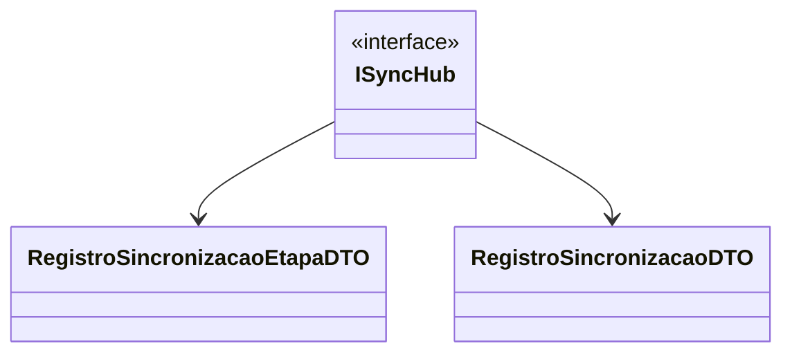

# ISyncHub
**Namespace**: IsthmusWinthor.Dominio.Hubs  
**Nome do Arquivo**: ISyncHub.cs  

> Interface responsável por definir os métodos de comunicação entre o servidor e os clientes no contexto de sincronização de dados.

## Métodos de Negócio

### 1. `InformarInicio(IEnumerable<RegistroSincronizacaoEtapaDTO> etapas)`
- **Objetivo**: Notificar o início de uma nova fase de sincronização de dados.
- **Comportamento**:
   1. O método recebe uma lista de etapas, que contêm informações sobre o que será sincronizado.
   2. As informações são comunicadas para os clientes conectados, permitindo que comecem a monitorar o progresso das etapas.
- **Retorno**: O método retorna uma `Task`, indicando que a operação é assíncrona e pode ser aguardada.

### 2. `InformarTermino(string mensagem)`
- **Objetivo**: Notificar o término do processo de sincronização.
- **Comportamento**:
   1. O método recebe uma mensagem que contém informações sobre o resultado da sincronização.
   2. Esta mensagem é enviada a todos os clientes para informá-los do estado final do processo.
- **Retorno**: O retorno é uma `Task`, indicando a operação assíncrona.

### 3. `AtualizarEtapa(RegistroSincronizacaoEtapaDTO etapa)`
- **Objetivo**: Atualizar o status da etapa de sincronização.
- **Comportamento**:
   1. O método recebe um objeto que contém detalhes da etapa a ser atualizada.
   2. Essa atualização é enviada aos clientes para que possam refletir a nova informação em suas interfaces.
- **Retorno**: O método retorna uma `Task`, indicando seu comportamento assíncrono.

### 4. `AtualizarSincronizacao(RegistroSincronizacaoDTO registroSincronizacao)`
- **Objetivo**: Atualizar informações sobre a sincronização em geral.
- **Comportamento**:
   1. Recebe um objeto que contém dados atualizados sobre a sincronização.
   2. Notifica os clientes sobre a nova situação da sincronização geral, permitindo que reajam a essa mudança.
- **Retorno**: O método é assíncrono e retorna uma `Task`.

### 5. `AdicionarUser(string user)`
- **Objetivo**: Adicionar um usuário à lista de usuários conectados ao hub de sincronização.
- **Comportamento**:
   1. Recebe um nome de usuário como string.
   2. Adiciona o usuário à lista de participantes, permitindo que ele receba atualizações sobre a sincronização.
- **Retorno**: O retorno é uma `Task`, indicando que esta operação é assíncrona.

## Tipos Auxiliares e Dependências
- **DTOs Utilizados**:
  - `[RegistroSincronizacaoEtapaDTO](RegistroSincronizacaoEtapaDTO.md)`
  - `[RegistroSincronizacaoDTO](RegistroSincronizacaoDTO.md)`

## Diagrama de Relacionamentos

