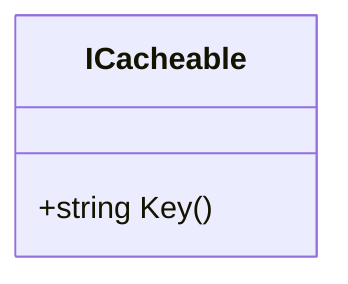

# ICacheable

**Namespace**: IsthmusWinthor.Dominio  
**Nome do Arquivo**: ICacheable.cs  

ICacheable é uma interface que define um contrato para objetos que podem ser armazenados em cache, assegurando que cada instância forneça uma chave única para identificação.

## Visão Geral e Responsabilidade
A interface ICacheable tem como objetivo fornecer uma estrutura padronizada para objetos que necessitam de armazenamento em cache. A chave que cada implementação deve retornar é essencial para garantir a integridade e eficiência no acesso a dados armazenados, promovendo melhor desempenho em sistemas que fazem uso intensivo de leitura de informações reaproveitáveis.

## Métodos de Negócio

### Título: Key() - Público
- **Objetivo**: Garante que toda implementação da interface ICacheable tenha uma chave única correspondente à sua instância, o que é essencial para a gestão eficiente de caches.
- **Comportamento**: 
  1. Quando chamada, a implementação do método deve retornar uma string que representa uma chave única.
  2. Essa chave pode ser baseada em propriedades do objeto ou em algoritmos específicos de geração de chaves.
  3. O sistema pode usar essa chave para armazenar ou recuperar o objeto do cache.
- **Retorno**: Retorna uma string que representa a chave única do objeto, permitindo sua identificação no cache.

## Propriedades Calculadas e de Validação
Não existem propriedades calculadas ou validações na interface, uma vez que ela apenas define um contrato sem implementações concretas.

## Navigation Property
Não existem propriedades de navegação, pois a interface não tem dependências de classes de domínio.

## Tipos Auxiliares e Dependências
Não são utilizados enumeradores ou classes auxiliares nesta interface.

## Diagrama de Relacionamentos

---
Gerada em 29/12/2025 20:05:16
