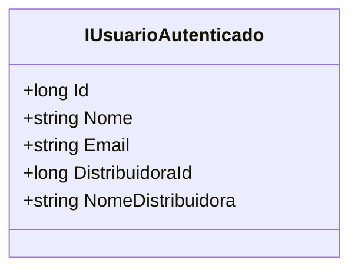

# IUsuarioAutenticado
**Namespace**: IsthmusWinthor.Dominio  
**Nome do Arquivo**: IUsuarioAutenticado.cs  

Esta interface define as propriedades que um usuário autenticado deve implementar, servindo como um contrato para a autenticação de usuários no sistema.

### Métodos de Negócio
- **Título**: Propriedades de Acesso Público  
- **Objetivo**: Garantir acesso às informações essenciais de um usuário autenticado dentro do sistema, permitindo que outras partes da aplicação possam detectar e utilizar dados como identificação, nome, e informações da distribuidora associada a este usuário.  

- **Comportamento**: As propriedades `Id`, `Nome`, `Email`, `DistribuidoraId`, e `NomeDistribuidora` fornecem dados diretamente do método de autenticação sem encapsular lógica ou cálculos. A implementação precisa ser feita nas classes que herdam essa interface, assegurando que todos os usuários autenticados tenham um conjunto consistente de atributos.  

- **Retorno**: Cada propriedade retorna um valor que representa características específicas do usuário autêntico no sistema, tendo seus tipos definidos como `long` (para Id e DistribuidoraId) e `string` (para Nome, Email e NomeDistribuidora).

### Propriedades Calculadas e de Validação
Nesta interface, todas as propriedades são anêmicas e não realizam cálculos ou validações. Elas apenas fornecem acesso a dados que devem ser implementados nas classes concretas que a herdam.

### Navigations Property
Não existem navegations properties nesta interface pois ela é apenas um contrato que define as propriedades do usuário e não contém referências a outras classes do domínio.

### Tipos Auxiliares e Dependências
Não há dependências de tipos auxiliares ou enumeradores utilizados nesta interface. Ela é uma estrutura básica que depende inteiramente de implementações concretas.

### Diagrama de Relacionamentos

---
Gerada em 29/12/2025 20:05:34
