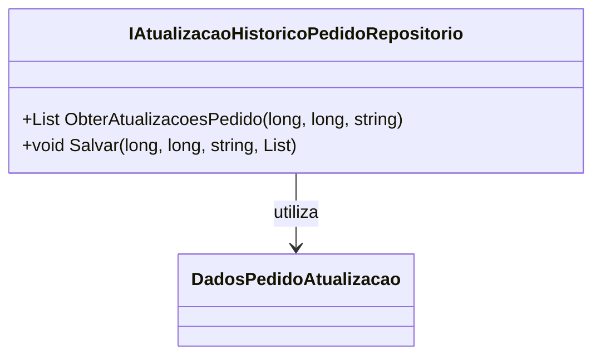

# IAtualizacaoHistoricoPedidoRepositorio

**Namespace**: IsthmusWinthor.Dominio.Interfaces  
**Nome do Arquivo**: IAtualizacaoHistoricoPedidoRepositorio.cs  

## Visão Geral e Responsabilidade
A interface `IAtualizacaoHistoricoPedidoRepositorio` tem como propósito garantir a atualização do histórico de pedidos em um sistema de gestão de vendas. Esta interface define as operações necessárias para obter e salvar informações sobre atualizações de pedidos, assegurando que as alterações sejam registradas e acessíveis pelos componentes do sistema, permitindo uma gestão eficaz dos pedidos e suporte ao cliente.

## Métodos de Negócio

### Título: `ObterAtualizacoesPedido` - `public`
- **Objetivo**: Garante a recuperação das atualizações de um pedido específico com base em sua identificação.
- **Comportamento**: 
  1. Recebe três parâmetros: `distribuidoraId`, `codigoCliente` e `identificadorPedidoCarrinho`.
  2. Realiza a consulta ao repositório para obter as atualizações de pedido que correspondem aos critérios fornecidos.
  3. Retorna uma lista de objetos do tipo `DadosPedidoAtualizacao` que contém as informações sobre as atualizações disponíveis para o pedido.
- **Retorno**: Uma lista (`List<DadosPedidoAtualizacao>`) representando todas as atualizações do pedido solicitado.

### Título: `Salvar` - `public`
- **Objetivo**: Garante que as atualizações de um pedido sejam salvas no histórico de forma persistente.
- **Comportamento**: 
  1. Recebe quatro parâmetros: `distribuidoraId`, `codigoCliente`, `identificadorPedidoCarrinho` e `dadosPedidoAtualizacao`.
  2. Valida os dados de entrada para assegurar que contenham informações corretas e completas.
  3. Persiste a lista de `DadosPedidoAtualizacao` no repositório, associando-a ao pedido específico identificado pelos outros três parâmetros.
- **Retorno**: Não há retorno, pois o objetivo é realizar uma operação de gravação.

## Propriedades Calculadas e de Validação
Não existem propriedades calculadas ou de validação nesta interface, uma vez que seus métodos são puramente operacionais.

## Navigations Property
Não há propriedades de navegação, pois a interface define apenas métodos que operam sobre dados de pedidos.

## Tipos Auxiliares e Dependências
- `DadosPedidoAtualizacao`: Representa as informações específicas sobre as atualizações de pedidos.

## Diagrama de Relacionamentos

Esta documentação fornece uma visão clara e concisa das responsabilidades e comportamentos da interface `IAtualizacaoHistoricoPedidoRepositorio`, assegurando que as regras de negócio relacionadas ao histórico de pedidos sejam compreendidas de maneira eficaz.
---
Gerada em 29/12/2025 21:14:29
