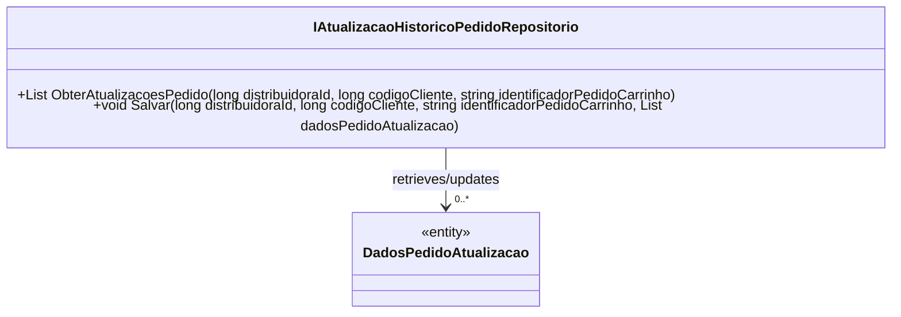

# IAtualizacaoHistoricoPedidoRepositorio
**Namespace**: IsthmusWinthor.Dominio.Interfaces  
**Nome do Arquivo**: IAtualizacaoHistoricoPedidoRepositorio.cs  

## Visão Geral e Responsabilidade
A interface `IAtualizacaoHistoricoPedidoRepositorio` define a estrutura para a manipulação de dados relacionados às atualizações de pedidos dentro do sistema. Ela é responsável por garantir que a integridade e a consistência das informações do histórico de pedidos sejam mantidas ao permitir recuperar e armazenar dados relevantes com base nos identificadores de distribuidora, cliente, e pedido. Este componente é vital para que as operações de negócios que dependem do histórico dos pedidos possam ser realizadas de maneira eficiente e precisa.

## Métodos de Negócio

### 1. `ObterAtualizacoesPedido` (Visibilidade: público)
- **Objetivo**: Este método garante que se possa recuperar as atualizações de um pedido específico com base em um conjunto de parâmetros. A regra de negócio assegura que todas as atualizações relevantes para um pedido sejam acessíveis para análise ou apresentação ao usuário.
- **Comportamento**:
  1. O método aceita três parâmetros: `distribuidoraId`, `codigoCliente` e `identificadorPedidoCarrinho`.
  2. Com base nesses identificadores, ele realiza uma consulta no repositório de dados para buscar todas as atualizações associadas ao pedido correspondente.
  3. Retorna uma lista de objetos `DadosPedidoAtualizacao`, que contém as informações sobre as atualizações do pedido.
- **Retorno**: O valor retornado é uma lista do tipo `List<DadosPedidoAtualizacao>`, representando todas as atualizações encontradas para o pedido especificado.

### 2. `Salvar` (Visibilidade: público)
- **Objetivo**: Este método assegura a integridade dos dados ao permitir que novas atualizações sejam gravadas no histórico de um pedido. A regra de negócio aqui é garantir que todas as mudanças relevantes feitas a um pedido sejam registradas adequadamente no sistema.
- **Comportamento**:
  1. O método recebe quatro parâmetros: `distribuidoraId`, `codigoCliente`, `identificadorPedidoCarrinho`, e uma lista de `dadosPedidoAtualizacao`.
  2. Com esses dados, ele efetua a gravação das atualizações no repositório de dados, associando-as corretamente ao pedido referente e ao cliente correspondente.
  3. O método não retorna valores, mas assegura que as atualizações sejam persistidas no sistema.
- **Retorno**: Não há valor retornado, pois o método é void. Seu impacto é visto na persistência dos dados.

## Propriedades Calculadas e de Validação
Nenhuma propriedade calculada ou de validação a ser listada nesta interface, pois ela se concentra em métodos de acesso aos dados.

## Navigations Property
Nenhuma Navigations Property a ser listada nesta interface, pois trata-se de uma interface que define operações sobre dados sem propriedades complexas.

## Tipos Auxiliares e Dependências
- `DadosPedidoAtualizacao`: Classe que contém informações sobre as atualizações de pedidos.  
   - [DadosPedidoAtualizacao](DadosPedidoAtualizacao.md)

## Diagrama de Relacionamentos

