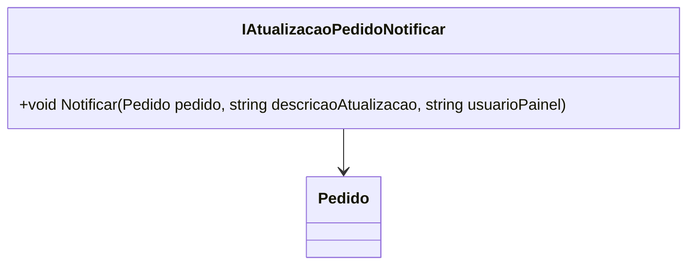

# IAtualizacaoPedidoNotificar
**Namespace**: IsthmusWinthor.Dominio.Interfaces  
**Nome do Arquivo**: IAtualizacaoPedidoNotificar.cs

Esta interface tem como objetivo definir um contrato para a notificação de atualizações de pedidos em um sistema de gerenciamento de pedidos. 

## Métodos de Negócio

### Título: Notificar (Visibilidade: Public)
- **Objetivo**: Assegurar que todas as atualizações de pedidos sejam comunicadas de forma adequada, garantindo que usuários relevantes sejam informados sobre as mudanças ocorridas.
- **Comportamento**:
  1. O método recebe um objeto `Pedido`, que contém informações sobre o estado atual do pedido.
  2. Se a `descricaoAtualizacao` não for fornecida, um valor padrão é utilizado ("Atualização de pedido").
  3. Opcionalmente, é possível indicar quem está realizando a atualização através do parâmetro `usuarioPainel`.
  4. O método implementará a lógica para enviar a notificação ao(s) usuário(s) pertinente(s) sobre a atualização do pedido, utilizando os dados fornecidos.
- **Retorno**: Este método não retorna um valor, mas sim desencadeia uma ação de notificação, garantindo a comunicação das atualizações.

## Tipos Auxiliares e Dependências
- Nenhuma Enum ou classe auxiliar foi identificada como dependência direta desta interface.

## Diagrama de Relacionamentos

