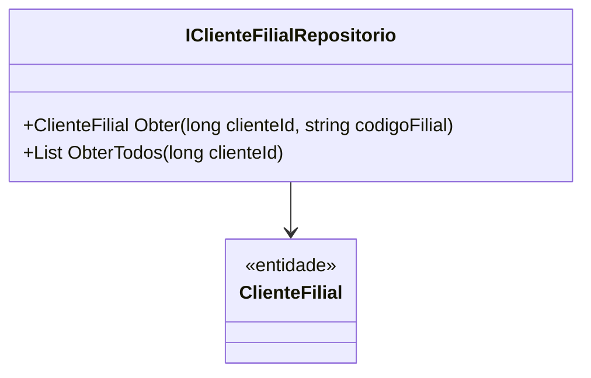

# IClienteFilialRepositorio
- **Namespace**: IsthmusWinthor.Dominio.Interfaces
- **Nome do Arquivo**: IClienteFilialRepositorio.cs

## Visão Geral e Responsabilidade
A interface `IClienteFilialRepositorio` é responsável por abstrair as operações de acesso a dados relacionadas à entidade `ClienteFilial`. O problema de negócio que ela resolve é a necessidade de interação eficiente com informações de filiais associadas a clientes, permitindo que o sistema acesse os dados de forma adequada e centralizada.

## Métodos de Negócio

### 1. `Obter(long clienteId, string codigoFilial)`
- **Objetivo**: Garante a recuperação de uma filial específica de um cliente dado seu identificador e código.
- **Comportamento**:
  1. O método recebe um `clienteId` e um `codigoFilial` como parâmetros.
  2. Realiza a busca na base de dados para encontrar a filial correspondente ao cliente informado.
  3. Se a filial for encontrada, retorna a instância da entidade `ClienteFilial`.
  4. Se não encontrada, pode retornar `null` ou lançar uma exceção (dependendo da implementação).
- **Retorno**: Uma instância de `ClienteFilial` ou `null` caso não exista a filial.

### 2. `ObterTodos(long clienteId)`
- **Objetivo**: Garante a recuperação de todas as filiais associadas a um cliente específico.
- **Comportamento**:
  1. O método recebe um `clienteId` como parâmetro.
  2. Realiza a busca na base de dados para recuperar todas as filiais que estão associadas ao cliente informado.
  3. Retorna uma lista de instâncias de `ClienteFilial`, que podem ser vazias se não houver filiais registradas.
- **Retorno**: Uma lista de `ClienteFilial`.

## Navigations Property
- Não há propriedades complexas de domínio listadas nesta interface, pois trata-se de uma interface de repositório.

## Tipos Auxiliares e Dependências
- Não há enumeradores ou classes auxiliares diretamente associadas à interface `IClienteFilialRepositorio`.

## Diagrama de Relacionamentos

---
Gerada em 29/12/2025 21:14:43
