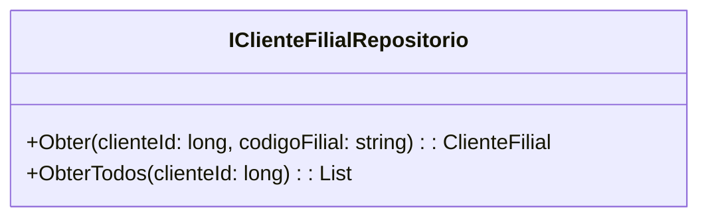

# IClienteFilialRepositorio
**Namespace**: IsthmusWinthor.Dominio.Interfaces  
**Nome do Arquivo**: IClienteFilialRepositorio.cs  

## Visão Geral e Responsabilidade
A interface `IClienteFilialRepositorio` atua como um contrato para repositórios que gerenciam entidades do tipo `ClienteFilial`. Seu principal objetivo é fornecer as operações necessárias para acessar os dados de clientes e suas filiais, garantindo que a camada de domínio possa interagir de forma eficiente com a fonte de dados subjacente. Esse padrão é essencial para assegurar a separação de responsabilidades e facilitar a manutenção e a testabilidade do sistema.

## Métodos de Negócio

### Título: Obter (public)
- **Objetivo**: Este método garante que seja possível recuperar uma filial específica associada a um cliente através de sua identificação e código.
- **Comportamento**: 
  1. Recebe como parâmetros um `clienteId` e um `codigoFilial`.
  2. Consulta a fonte de dados para localizar a `ClienteFilial` correspondente.
  3. Retorna a instância de `ClienteFilial` encontrada ou `null` se não houver correspondência.
- **Retorno**: Retorna um objeto do tipo `ClienteFilial` que contém os dados da filial solicitada ou `null` se nenhuma filial for encontrada.

### Título: ObterTodos (public)
- **Objetivo**: Este método assegura a recuperação de todas as filiais associadas a um cliente específico.
- **Comportamento**:
  1. Recebe como parâmetro o `clienteId`.
  2. Consulta a fonte de dados para obter uma lista de `ClienteFilial` que correspondem ao identificador do cliente.
  3. Retorna a lista de `ClienteFilial` correspondente.
- **Retorno**: Retorna uma lista de instâncias de `ClienteFilial` que pertencem ao cliente indicado.

## Propriedades Calculadas e de Validação
N/A

## Navigation Property
N/A

## Tipos Auxiliares e Dependências
N/A

## Diagrama de Relacionamentos

