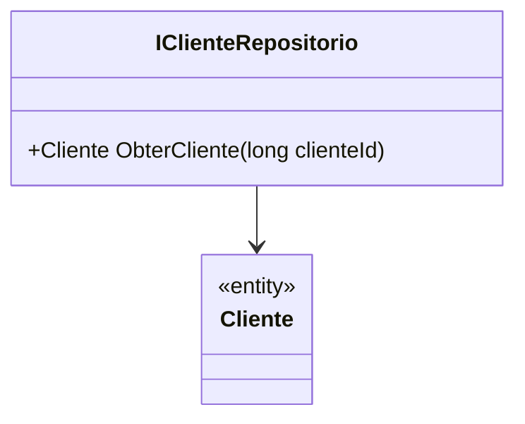

# IClienteRepositorio

**Namespace**: IsthmusWinthor.Dominio.Interfaces  
**Nome do Arquivo**: IClienteRepositorio.cs

## Visão Geral e Responsabilidade
A interface `IClienteRepositorio` é responsável por definir as operações necessárias para a manipulação de dados relacionados ao cliente no sistema corporativo. Ela atua como um contrato que implementações específicas devem seguir, permitindo uma desacoplamento entre a lógica de negócios e a persistência de dados. O problema de negócio que resolve é a abstração da forma como os dados de clientes são acessados e gerenciados, garantindo que a aplicação possa interagir com diferentes fontes de dados de maneira uniforme.

## Métodos de Negócio

### Método: ObterCliente (Público)
- **Objetivo**: Garante que o sistema possa recuperar os dados de um cliente com base em seu identificador único (`clienteId`).
- **Comportamento**: 
  1. O método recebe um identificador `clienteId`.
  2. Ele consulta a fonte de dados (por exemplo, um banco de dados) para localizar as informações do cliente correspondente a esse ID.
  3. Retorna a instância do objeto `Cliente` associado ao `clienteId` fornecido, ou `null` se nenhuma correspondência for encontrada.
- **Retorno**: Retorna um objeto `Cliente` que contém as informações do cliente ou `null` se o cliente não for encontrado.

## Tipos Auxiliares e Dependências
- Não há Enumeradores (Enums) ou Classes Estáticas/Helpers referenciadas diretamente na interface.

## Diagrama de Relacionamentos

Este diagrama de classes ilustra que a interface `IClienteRepositorio` depende da classe `Cliente`, representando a relação entre as operações de armazenamento e as entidades do domínio.
---
Gerada em 29/12/2025 21:14:51
