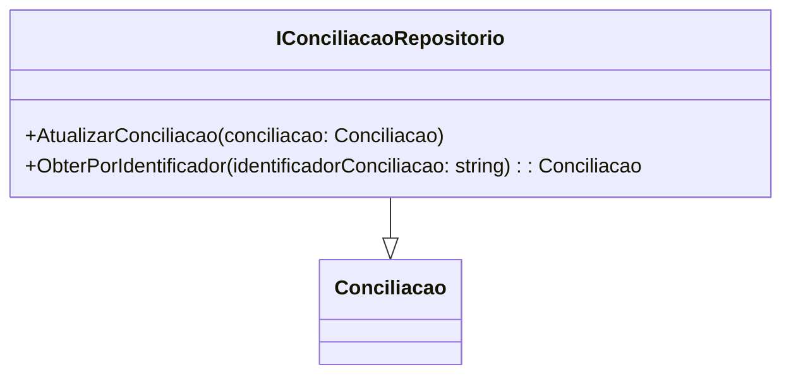

# IConciliacaoRepositorio
**Namespace**: IsthmusWinthor.Dominio.Interfaces  
**Nome do Arquivo**: IConciliacaoRepositorio.cs  

Este arquivo contém a definição da interface `IConciliacaoRepositorio`, que atua como um contrato para as operações de acesso e manipulação de entidades de conciliação no domínio. É fundamental para a abstração em torno da persistência e recuperação de dados relacionados às conciliações.

## Métodos de Negócio

### 1. `void AtualizarConciliacao(Conciliacao conciliacao)`
**Objetivo**: Este método garante que uma entidade de conciliação existente no repositório seja atualizada corretamente, refletindo as modificações de estado ou informações que possam ter ocorrido.

**Comportamento**: 
1. Recebe um objeto do tipo `Conciliacao` como parâmetro.
2. Verifica se a entidade existe no repositório.
3. Aplica as mudanças contidas no objeto recebido à entidade que está armazenada.
4. Persiste as mudanças no banco de dados.

**Retorno**: Este método não retorna um valor, mas deve lançar exceções em caso de falhas na atualização.

### 2. `Conciliacao ObterPorIdentificador(string identificadorConciliacao)`
**Objetivo**: Este método garante a recuperação de uma entidade de conciliação específica a partir de um identificador único, permitindo trabalhar com a instância correta do objeto.

**Comportamento**:
1. Recebe um `string` que representa o identificador da conciliação.
2. Realiza uma busca no repositório utilizando o identificador fornecido.
3. Retorna a instância de `Conciliacao` correspondente ou um valor nulo se não existir.

**Retorno**: Retorna um objeto do tipo `Conciliacao` correspondente ao identificador, ou `null` caso não exista.

## Tipos Auxiliares e Dependências
- Classe: `Conciliacao` é uma entidade central representativa das informações de conciliação. Ela deve ser consultada em sua definição para entender melhor seu conteúdo e regras de negócio associadas.

## Diagrama de Relacionamentos

Esta documentação foi elaborada para descrever claramente as responsabilidades e comportamentos da interface `IConciliacaoRepositorio`, básica para a manipulação de dados de conciliação no sistema.
---
Gerada em 29/12/2025 21:15:02
