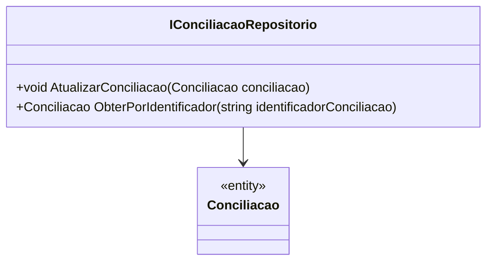

# IConciliacaoRepositorio
**Namespace**: IsthmusWinthor.Dominio.Interfaces  
**Nome do Arquivo**: IConciliacaoRepositorio.cs  

O `IConciliacaoRepositorio` é uma interface que define operações à camada de persistência relacionadas à entidade de `Conciliacao`. Seu papel principal é garantir a integridade e a persistência dos dados de conciliação no sistema, fornecendo métodos para atualização e recuperação de informações.

## Métodos de Negócio

### 1. AtualizarConciliacao
- **Objetivo**: Garantir que uma conciliação específica seja atualizada no repositório com os dados mais recentes.
- **Comportamento**: 
  1. Recebe um objeto `Conciliacao` como parâmetro.
  2. Atualiza os dados persistidos no repositório com as informações contidas neste objeto.
  3. Aplica qualquer lógica necessária para garantir que a atualização seja válida (ex: checar a integridade dos dados antes de atualizar).
  
- **Retorno**: Este método é void, não retorna valor, mas garante que a conciliação foi atualizada corretamente no repositório.

### 2. ObterPorIdentificador
- **Objetivo**: Permitir a recuperação de uma conciliação específica usando seu identificador único.
- **Comportamento**: 
  1. Recebe um string `identificadorConciliacao` como parâmetro.
  2. Busca a conciliação correspondente no repositório com base neste identificador.
  3. Retorna o objeto `Conciliacao` encontrado, ou null se não for encontrado.

- **Retorno**: Retorna um objeto do tipo `Conciliacao` se encontrado, caso contrário, retorna `null`.

## Tipos Auxiliares e Dependências
- **Dependências**: Essa interface depende da classe `Conciliacao`, que deve ser definida em algum lugar no domínio.
  
## Diagrama de Relacionamentos

