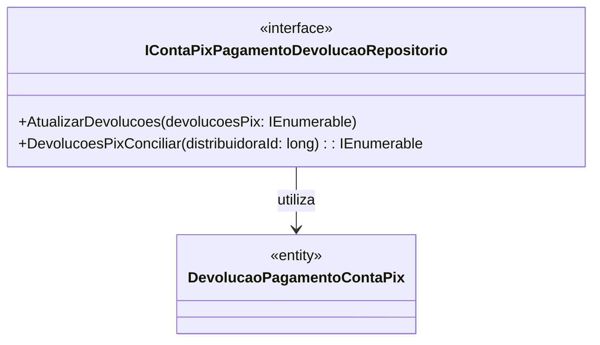

# IContaPixPagamentoDevolucaoRepositorio
- **Namespace**: IsthmusWinthor.Dominio.Interfaces
- **Nome do Arquivo**: IContaPixPagamentoDevolucaoRepositorio.cs

## Visão Geral e Responsabilidade
A interface `IContaPixPagamentoDevolucaoRepositorio` define as operações necessárias para a manipulação das devoluções dos pagamentos feitos via Conta Pix. Ela é crucial para garantir a integridade dos dados relacionados às transações financeiras, assegurando que as informações sobre devoluções sejam atualizadas e acessíveis para processos de conciliação. Sua implementação deve resolver problemas de gerenciamento de pagamentos devolvidos e facilitar a conciliação financeira.

## Métodos de Negócio

### 1. `AtualizarDevolucoes(IEnumerable<DevolucaoPagamentoContaPix> devolucoesPix)`
- **Objetivo**: Este método é responsável pela atualização das informações referentes às devoluções de pagamentos realizados via Conta Pix, garantindo que o estado atual das devoluções seja refletido no repositório.
- **Comportamento**: 
  1. Recebe uma coleção de objetos `DevolucaoPagamentoContaPix`.
  2. Verifica se a coleção não está vazia.
  3. Itera sobre cada devolução, aplicando as atualizações necessárias no repositório.
  4. Persiste as alterações, garantindo que os dados estejam atualizados para futuras consultas ou operações.
- **Retorno**: Este método não retorna um valor; seu propósito é apenas atuar na atualização do estado do repositório.

### 2. `DevolucoesPixConciliar(long distribuidoraId)`
- **Objetivo**: Este método busca e fornece uma lista das devoluções de pagamentos realizadas via Conta Pix para uma distribuidora específica, facilitando o processo de conciliação financeira.
- **Comportamento**:
  1. Recebe um identificador de distribuidora como parâmetro.
  2. Consulta o repositório para buscar todas as devoluções associadas ao ID fornecido.
  3. Filtra e retorna apenas as devoluções que estão pendentes de conciliação.
- **Retorno**: Retorna uma coleção de objetos `DevolucaoPagamentoContaPix`, que representa as devoluções associadas à distribuidora.

## Propriedades Calculadas e de Validação
- Esta interface não possui propriedades a serem listadas, focando apenas nos métodos de manipulação de dados.

## Navigations Property
- Não existem propriedades de navegação complexas nesta interface, pois ela serve unicamente como um contrato para as operações de reposição.

## Tipos Auxiliares e Dependências
- `DevolucaoPagamentoContaPix`: Representa a entidade que contém as informações sobre as devoluções de pagamento realizado via Conta Pix.

## Diagrama de Relacionamentos

