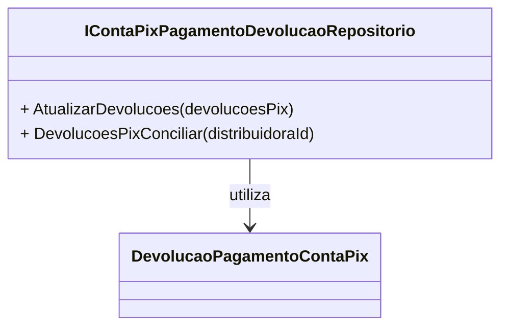

# IContaPixPagamentoDevolucaoRepositorio
**Namespace**: IsthmusWinthor.Dominio.Interfaces  
**Nome do Arquivo**: IContaPixPagamentoDevolucaoRepositorio.cs  

## Visão Geral e Responsabilidade
A interface `IContaPixPagamentoDevolucaoRepositorio` tem a responsabilidade de definir os contratos para ações relacionadas às devoluções de pagamentos via conta Pix. Ela é essencial no contexto de gestão de pagamentos, particularmente para a conciliação de devoluções que impactam o fluxo financeiro da distribuidora. Através desta interface, é possível tratar devoluções de pagamentos, garantindo que as informações estejam sempre atualizadas e prontas para consultas, o que aprimora o controle financeiro e a transparência junto aos usuários finais.

## Métodos de Negócio

### 1. AtualizarDevolucoes
- **Título**: `AtualizarDevolucoes` (public)
- **Objetivo**: Garante a atualização das informações de devoluções de pagamentos realizadas via Pix.
- **Comportamento**: 
  1. Recebe uma coleção de objetos `DevolucaoPagamentoContaPix`.
  2. Para cada objeto fornecido, atualiza as informações existentes na base de dados relacionadas a devoluções de pagamentos.
  3. Persiste as alterações, garantindo que a base de dados reflita o estado mais recente das devoluções.
- **Retorno**: O método não retorna valor, mas deve falhar caso ocorra algum erro na persistência das alterações.

### 2. DevolucoesPixConciliar
- **Título**: `DevolucoesPixConciliar` (public)
- **Objetivo**: Obtem a lista de devoluções de pagamentos via Pix para um determinado ID de distribuidora, facilitando a conciliação financeira.
- **Comportamento**: 
  1. Recebe o ID da distribuidora como parâmetro.
  2. Consulta o repositório para obter todas as devoluções de pagamento relacionadas ao ID fornecido.
  3. Retorna uma lista de objetos `DevolucaoPagamentoContaPix` que representa as devoluções a serem conciliadas.
- **Retorno**: Uma coleção enumerável de devoluções de pagamento via Pix, ou uma lista vazia se não houver devoluções pendentes.

## Propriedades Calculadas e de Validação
Não há propriedades calculadas ou de validação a serem documentadas nesta interface, uma vez que se trata exclusivamente de métodos.

## Navigation Property
Não há Navigation Properties a serem listadas nesta interface.

## Tipos Auxiliares e Dependências
- **Tipos Auxiliares**: 
  - [DevolucaoPagamentoContaPix](DevolucaoPagamentoContaPix.md)

## Diagrama de Relacionamentos

---
Gerada em 29/12/2025 21:15:15
