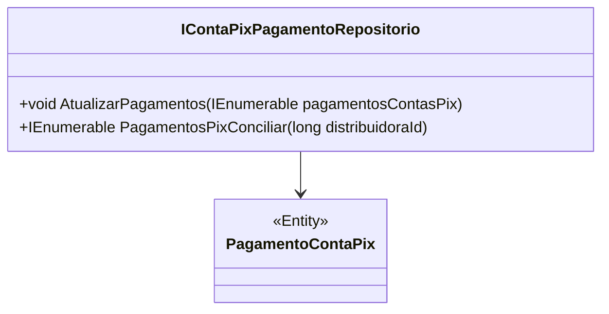

# IContaPixPagamentoRepositorio
**Namespace**: IsthmusWinthor.Dominio.Interfaces  
**Nome do Arquivo**: IContaPixPagamentoRepositorio.cs  

## Visão Geral e Responsabilidade
A interface `IContaPixPagamentoRepositorio` é responsável por definir as operações de persistência relacionadas a pagamentos realizados através do sistema de Conta Pix. O principal objetivo da interface é facilitar a manutenção e atualização dos registros de pagamentos, garantindo que as informações estejam sempre atualizadas e disponíveis para conciliação. Este repositório desempenha um papel crítico na integridade e disponibilidade dos dados relacionados a transações financeiras.

## Métodos de Negócio

### AtualizarPagamentos
- **Título**: AtualizarPagamentos (Visibilidade: public)
- **Objetivo**: Garante que os pagamentos recebidos sejam atualizados no sistema, refletindo qualquer alteração necessária.
- **Comportamento**: Este método aceita uma coleção de pagamentos (`IEnumerable<PagamentoContaPix>`) e atualiza os registros correspondentes no banco de dados. A lógica inclui iterar sobre cada pagamento, aplicar as modificações e persistir estas mudanças no repositório de dados. É essencial garantir que os dados atualizados não causem inconsistências.
- **Retorno**: Este método não retorna um valor, mas espera-se que, ao final de sua execução, os pagamentos no repositório tenham sido corretamente atualizados.

### PagamentosPixConciliar
- **Título**: PagamentosPixConciliar (Visibilidade: public)
- **Objetivo**: Extrai pagamentos específicos para conciliação, baseando-se no `distribuidoraId`, para permitir a verificação e o alinhamento de registros financeiros.
- **Comportamento**: Este método recebe um identificador de distribuidora como parâmetro e realiza uma busca por todos os pagamentos de Conta Pix associados a essa distribuidora. O retorno é uma lista de pagamentos que precisam ser conciliados, permitindo o trabalho de reconciliação financeira para evitar discrepâncias.
- **Retorno**: Retorna uma coleção (`IEnumerable<PagamentoContaPix>`) de objetos `PagamentoContaPix` que representam pagamentos que estão prontos para ou necessitam de conciliação.

## Propriedades Calculadas e de Validação
Não há propriedades calculadas ou de validação a serem listadas nesta interface, pois ela apenas define contratos para métodos de negócio.

## Navigations Property
Não há propriedades de navegação a serem listadas nesta interface, pois se trata de uma interface focada em operações sobre pagamentos.

## Tipos Auxiliares e Dependências
- **Dependências**: 
  - `PagamentoContaPix` (Classe auxiliar representando um pagamento via Conta Pix).

## Diagrama de Relacionamentos

