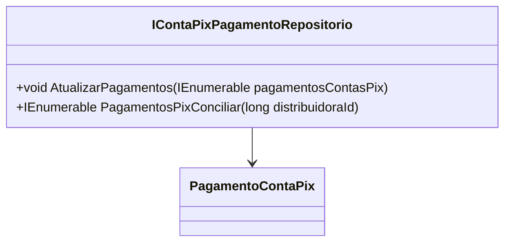

# IContaPixPagamentoRepositorio
**Namespace**: IsthmusWinthor.Dominio.Interfaces  
**Nome do Arquivo**: IContaPixPagamentoRepositorio.cs  

## Visão Geral e Responsabilidade
A interface `IContaPixPagamentoRepositorio` define a estrutura para operações relacionadas aos pagamentos de contas via Pix. Seu papel é puramente de abstração de acesso a dados, permitindo a atualização e a consulta dos registros de pagamentos. Este repositório é fundamental para garantir que as informações financeiras sejam processadas e manipuladas de forma segura e eficiente, assegurando a integridade dos dados relacionados aos pagamentos através da ferramenta de conciliação.

## Métodos de Negócio

### 1. AtualizarPagamentos
- **Visibilidade**: Público
- **Objetivo**: Garante que uma coleção de pagamentos de contas Pix seja preservada de forma atualizada no sistema.
- **Comportamento**: 
  1. Recebe uma coleção de objetos `PagamentoContaPix` que representam pagamentos.
  2. Realiza a operação de atualização no armazenamento persistente, modificando os registros existentes conforme necessário.
  3. Pode incluir validações adicionais ou exceções em implementações concretas para preservar a consistência dos dados.
- **Retorno**: Este método não retorna nenhum valor, mas lança exceções em casos de falha na atualização.

### 2. PagamentosPixConciliar
- **Visibilidade**: Público
- **Objetivo**: Extrai registros de pagamentos realizados via Pix para uma distribuidora específica, facilitando o processo de conciliação.
- **Comportamento**:
  1. Recebe a identificação da distribuidora (`distribuidoraId`) como parâmetro.
  2. Consulta a base de dados para recuperar todos os pagamentos associados a esta distribuidora.
  3. Retorna uma coleção de objetos `PagamentoContaPix`, permitindo que outras partes do sistema efetuem a conciliação necessária.
- **Retorno**: Retorna uma coleção de `PagamentoContaPix` que representa os pagamentos que devem ser conciliados.

## Propriedades Calculadas e de Validação
Não existem propriedades dentro desta interface, uma vez que se trata de um contrato para repositório sem implementação de lógica ou propriedades a serem calculadas ou validadas.

## Navigations Property
Não existem propriedades complexas do domínio diretamente associadas a esta interface. Os métodos fazem uso de `PagamentoContaPix`, que é uma entidade que poderia ser explorada, mas não são propriedades dentro de `IContaPixPagamentoRepositorio`.

## Tipos Auxiliares e Dependências
- **Classes Dependentes**: 
  - [PagamentoContaPix](PagamentoContaPix.md) - Representa um pagamento via Pix.

## Diagrama de Relacionamentos

---
Gerada em 29/12/2025 21:15:28
