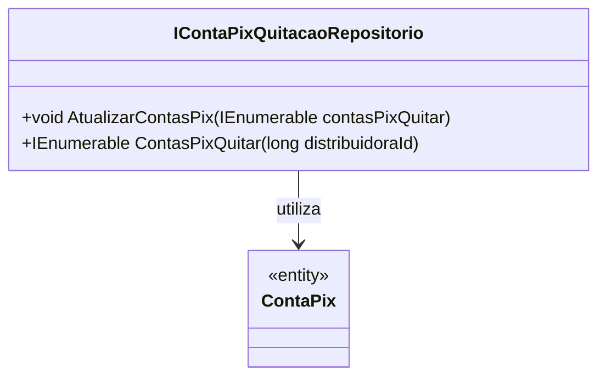

# IContaPixQuitacaoRepositorio
**Namespace**: IsthmusWinthor.Dominio.Interfaces  
**Nome do Arquivo**: IContaPixQuitacaoRepositorio.cs  

## Visão Geral e Responsabilidade
A interface `IContaPixQuitacaoRepositorio` é responsável por definir as operações relacionadas à quitação de contas no sistema de pagamento via PIX. Ela oferece métodos para atualizar informações de contas a serem quitadas e para consultar essas contas com base em um identificador específico de distribuidora. Esta interface é fundamental para garantir a manipulação adequada dos dados de quitação de contas, promovendo a integridade e a consistência nas operações financeiras do sistema.

## Métodos de Negócio

### 1. `AtualizarContasPix(IEnumerable<ContaPix> contasPixQuitar)`
- **Objetivo**: Este método garante que as informações das contas Pix sejam atualizadas no sistema, assegurando que os registros estejam sempre alinhados com as operações realizadas pelos usuários.
- **Comportamento**: 
  1. Recebe uma coleção de objetos `ContaPix` que representam as contas a serem atualizadas.
  2. Itera sobre cada conta da coleção, aplicando as atualizações necessárias ao banco de dados.
  3. Confirma as alterações para garantir a persistência.
  
- **Retorno**: Este método não possui retorno, mas deve garantir que as contas foram atualizadas sem erros.

### 2. `ContasPixQuitar(long distribuidoraId)`
- **Objetivo**: Este método garante a recuperação das contas Pix que estão pendentes de quitação, filtrando-as por um identificador de distribuidora.
- **Comportamento**: 
  1. Recebe um `distribuidoraId` que identifica a distribuidora associada às contas.
  2. Realiza uma consulta no repositório para buscar todas as contas Pix que pertencem à distribuidora especificada.
  3. Retorna a lista de contas encontradas.
  
- **Retorno**: Retorna uma coleção IEnumerable de `ContaPix` que representa as contas a serem quitadas.

## Navigations Property
Não existem propriedades complexas do domínio diretamente nesta interface.

## Tipos Auxiliares e Dependências
- **Classes e Tipos Relacionados**:
  - `[ContaPix](ContaPix.md)`: Representa a entidade de conta PIX utilizada nas operações de quitação.

## Diagrama de Relacionamentos

